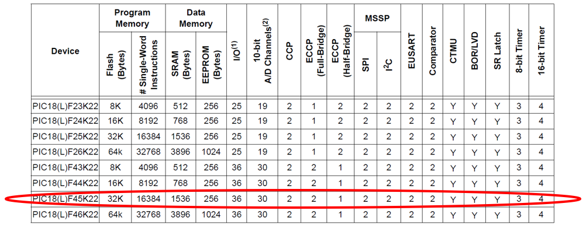
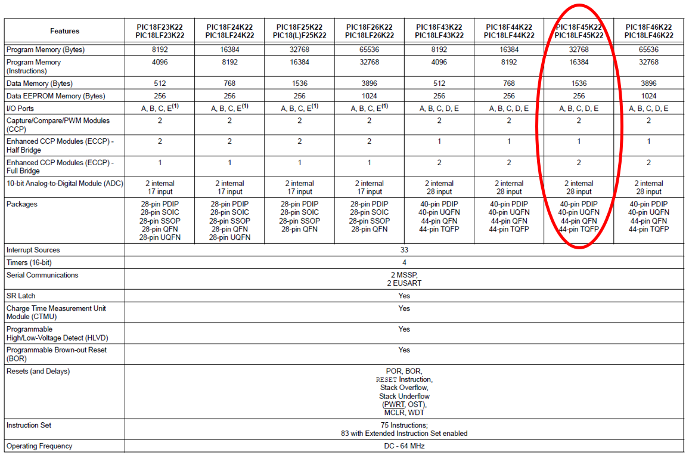
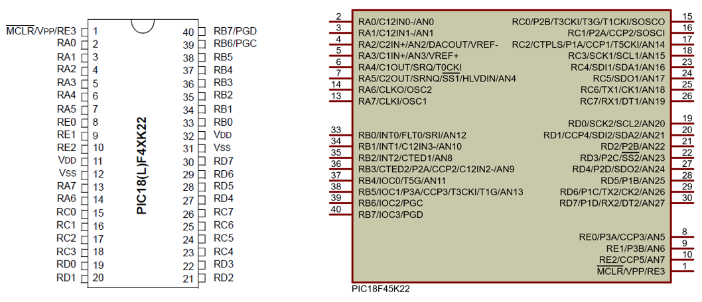
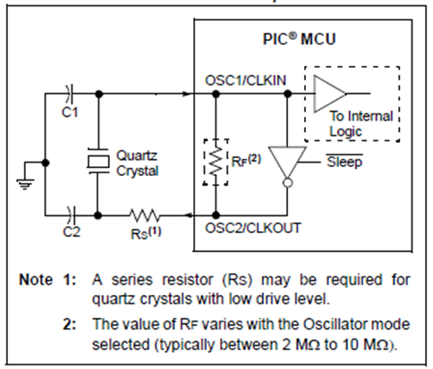

<h1>Aula 2</h1>

Esta clase consiste en realizar una introducción al PIC 18F45K22, estudiando los recursos con los que cuenta este microcontrolador.

<h2>PIC 18F45K22</h2>

El PIC 18F45k22 es un microcontrolador PIC (Peripheral Interface Controller) de 40 pines de la familia de 8 bits de Microchip. La CPU es de tipo RISC, el cual ofrece alta velocidad de procesamiento mayor a 10 MIPs (64MHz).

Fuente: Datasheet PIC 18F45K22

Fuente: Datasheet PIC 18F45K22

Fuente: Datasheet PIC 18F45K22 y Proteus

Puertos digitales y análogos:
- 5 puertos digitales (A, B, C, D y E)
- 28 canales análogos

Alimentación:
- 2 pines de Vdd (+5V) 
- 2 pines de Vss (0V) 

Periféricos:

- 3 pines externos para interrupciones
- 4 interrupciones por teclado (detección de los dos flancos)
- 28 canales para conversión A/D a 10 bits 
- 2 USART (comunicación serial - Rx y Tx) 
- 2 MSSP (master synchronous serial port) para SPI e I2C *
- 7 timers (4 de 16 bits y 3 de 8 bits)
- 5 modulos de PWM*

Frecuencia de oscilación:
- 2 pines de Clock 

Fuente: Datasheet PIC 18F45K22

<h3>Coordenadas cartesianas</h3>
