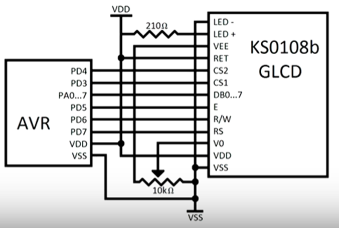
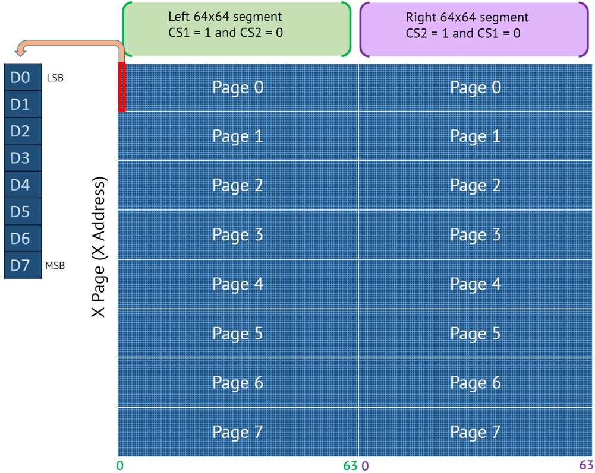
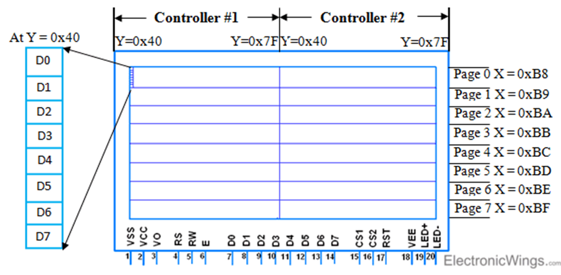
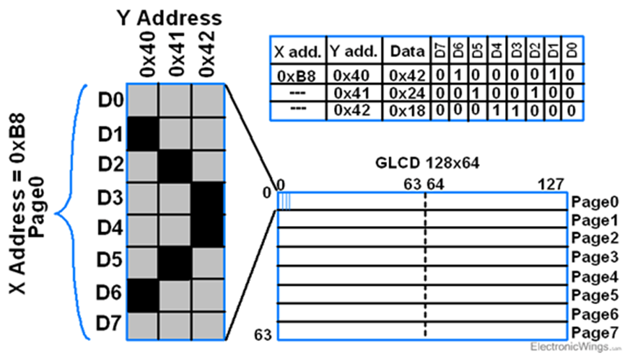
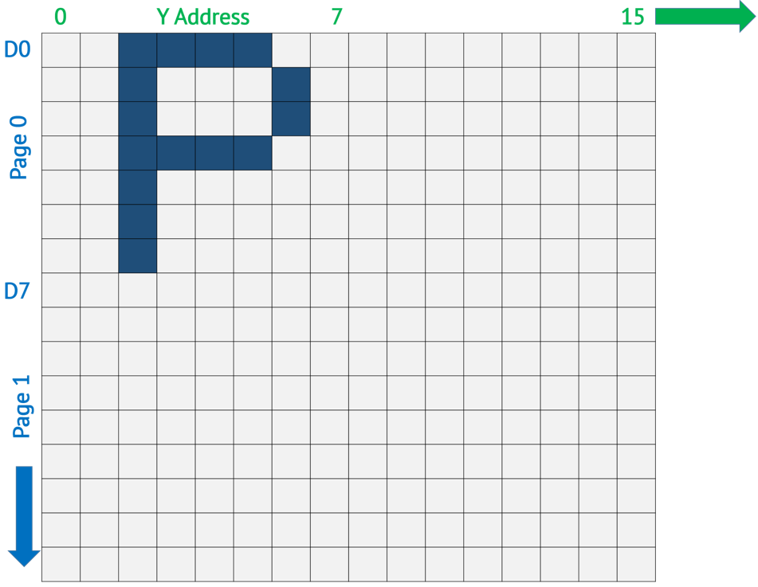
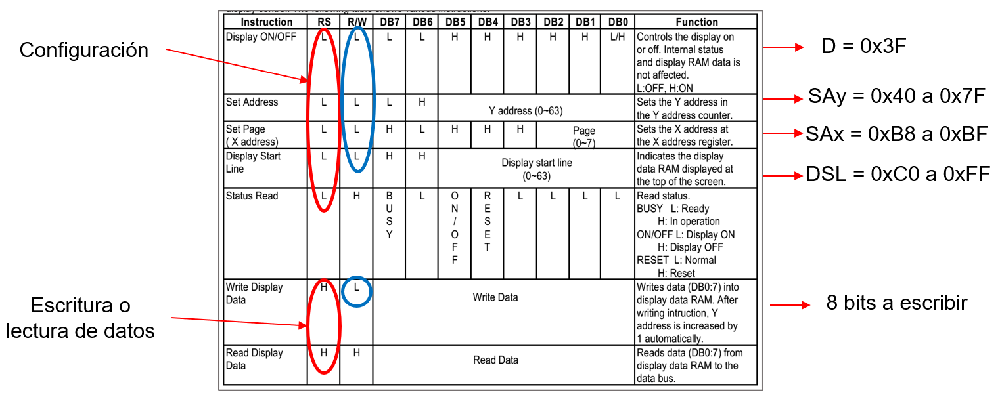
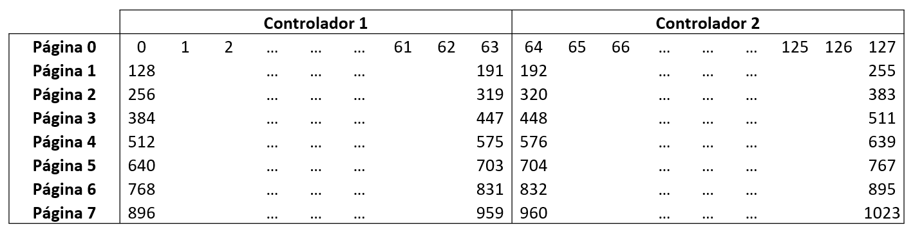
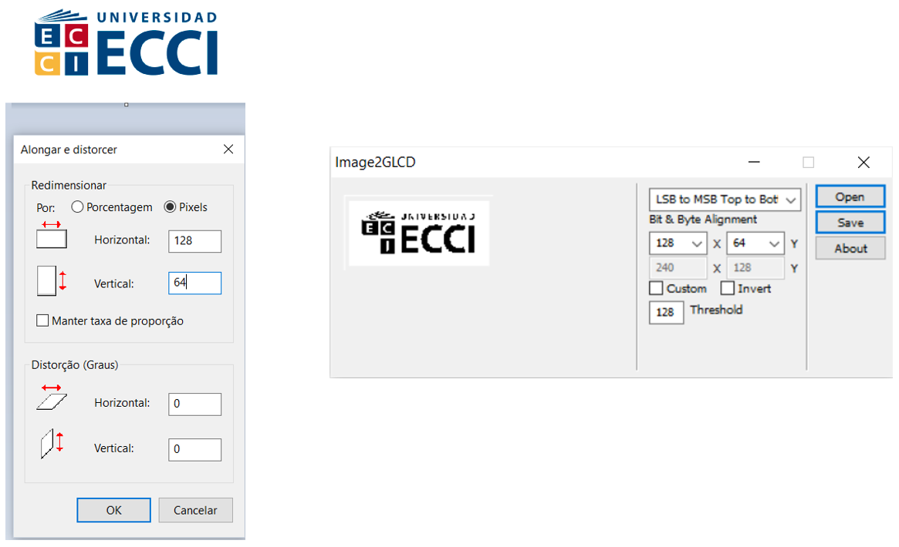

<h1>Aula 3</h1>

Esta clase consiste en estudiar la pantalla GLCD (KS0108).

<h2>Pantalla GLCD</h2>

Las pantallas gráficas de cristal líquido (GLCD) son monocromáticas. Consumen poca energía eléctrica, siendo su principal ventaja. Así mismo, hay diferentes controladores, como el chip KS0108 de Samsung.


<h2>GLCD 128x64</h2>


Fuente: https://www.electronicwings.com/pic/glcd-128x64-interfacing-with-pic18f4550-microcontroller


Fuente: Fuente: https://www.pjrc.com/teensy/td_libs_GLCD.html






Fuente: https://openlabpro.com/guide/ks0108-graphic-lcd-interfacing-with-pic18f4550-part-1/



Fuente: https://www.electronicwings.com/sensors-modules/glcd-128x64



Fuente: https://www.electronicwings.com/sensors-modules/glcd-128x64



<h3>Registros GLCD</h3>



```c
//GLCD
#define D 0x3F
#define SAy 0x40
#define SAx 0xB8
#define DSL 0xC0
```

<h3>Ejemplo 1</h3>

Utilizar una pantalla GLCD 128x64 para visualizar los ejemplos analizados anteriormente (> y P).

<h3>Ejemplo 2</h3>

Utilizar una pantalla GLCD 128x64 para escribir texto (palabras y números), teniendo en cuenta el software GLCDFastLcdFontCreator.jar el cual creará un vector de 1024 bytes.



<h3>Ejemplo 3</h3>

Utilizar una pantalla GLCD 128x64 para visualizar una imagen, utilizando el software Image2GLCD.




