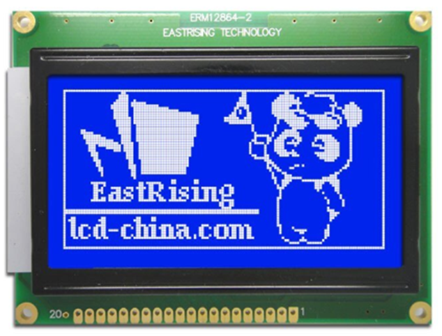
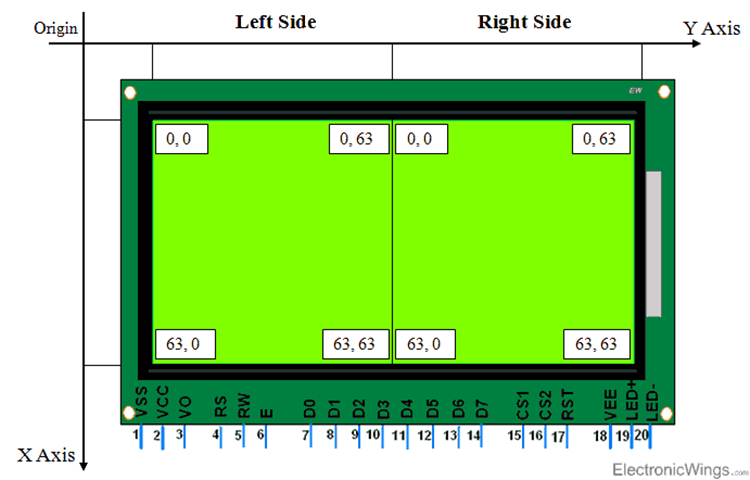
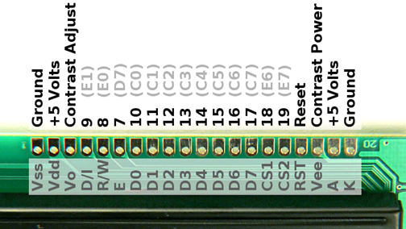
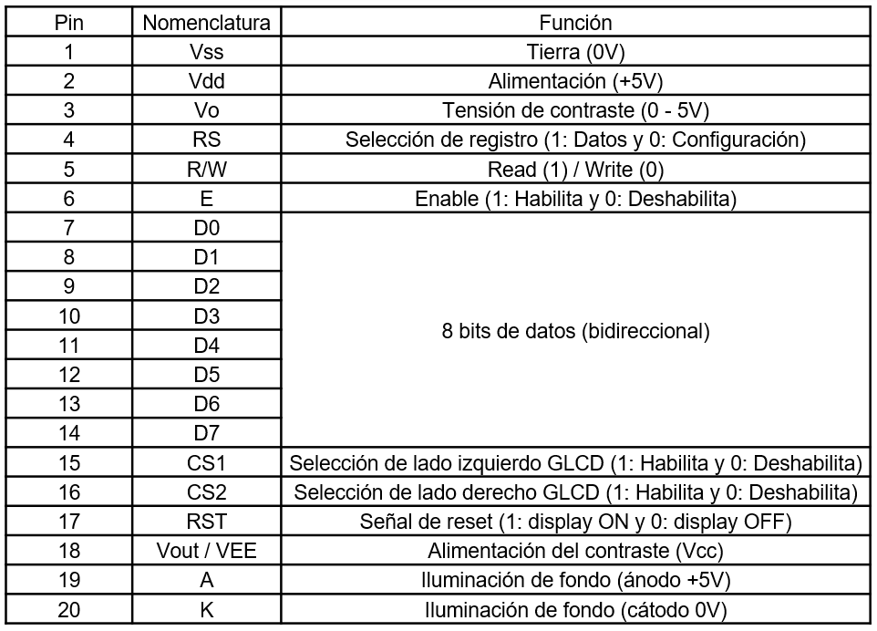

<h1>Aula 3</h1>

Esta clase consiste en estudiar la pantalla GLCD (KS0108).

<h2>Pantalla GLCD</h2>

Las pantallas gráficas de cristal líquido (GLCD) son monocromáticas. Consumen poca energía eléctrica, siendo su principal ventaja. Así mismo, hay diferentes controladores, como el chip KS0108 de Samsung.

<h3>Pantalla GLCD</h3>

Fuente: https://www.electronicwings.com/pic/glcd-128x64-interfacing-with-pic18f4550-microcontroller

Fuente: Fuente: https://www.pjrc.com/teensy/td_libs_GLCD.html

