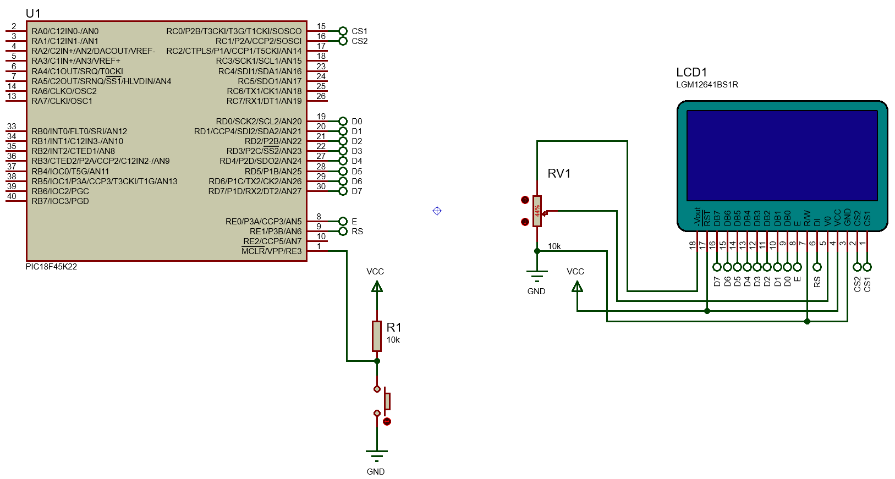

<h1>Aula 3</h1>

Esta clase consiste en estudiar la pantalla GLCD (KS0108).

<h2>Pantalla GLCD</h2>

Las pantallas gráficas de cristal líquido (GLCD) son monocromáticas. Consumen poca energía eléctrica, siendo su principal ventaja. Así mismo, hay diferentes controladores, como el chip KS0108 de Samsung.


<h2>GLCD 128x64</h2>

La GLCD KS0108 tiene 8192 bits (1024 bytes), a lo cual se debe tener en cuenta que cada bit es un led.


Fuente: https://www.electronicwings.com/pic/glcd-128x64-interfacing-with-pic18f4550-microcontroller

Los pines de conexión de la GLCD KS0108 son de entradas y/o salidas, así mismo, algunos pines son de potencia o control.


Fuente: Fuente: https://www.pjrc.com/teensy/td_libs_GLCD.html


La principal característica de todas las conexiones de la GLCD KS0108 con un microcontrolador es la conexión del potenciómetro, siendo que un pin del extremo se debe conectar a la alimentación del contraste (VEE).


La GLCD KS0108 se divide en dos secciones o controladores, haciendo referencia al lado derecho e izquierdo. De igual manera, cada controlador se compone de 64x64 bits, siendo que se subdivide en 8 páginas o renglones o filas, donde en cada fila se tienen 64 vectores columna de 8 bits.


Fuente: https://openlabpro.com/guide/ks0108-graphic-lcd-interfacing-with-pic18f4550-part-1/

El direccionamiento en una coordenada específica en la GLCD KS0108 se realiza a través de la combinación de coordenadas tanto horizontal (Y) como vertical (X).


Fuente: https://www.electronicwings.com/sensors-modules/glcd-128x64


Fuente: https://www.electronicwings.com/sensors-modules/glcd-128x64


<h3>Registros GLCD</h3>

Los registros de la GLCD KS0108 se analizan desde el datasheet del fabricante para las diferentes instrucciones de uso de dicha pantalla, teniendo en cuenta principalmente el pin RS y R/W.


```c
//GLCD
#define D 0x3F
#define SAy 0x40
#define SAx 0xB8
#define DSL 0xC0
```

<h3>Ejemplo 1</h3>

Utilizar una pantalla GLCD 128x64 para visualizar los ejemplos analizados anteriormente (> y P).



```c
#include <xc.h>

#pragma config FOSC = INTIO67
#pragma config WDTEN = OFF
#pragma config LVP = OFF

#define _XTAL_FREQ 16000000
#define time 10
//GLCD
#define D 0x3F
#define SAy 0x40
#define SAx 0xB8
#define DSL 0xC0
#define CS1 LATC0
#define CS2 LATC1
#define E LATE0
#define RS LATE1

void settings(void);
//GLCD
void SelectController(unsigned char page1, unsigned char page2);
void SettingsGLCD(unsigned char word);
void WriteGLCD(unsigned char word);
void GLCD(unsigned char word);
void ClearGLCD(void);
void coordinate(unsigned char axisX, unsigned char axisY);
void WritePage1(void);
void WritePage2(void);

void main(void) {
    settings();
    WritePage1();
    WritePage2();
    while (1) {

    }
}

void settings(void) {
    OSCCON = 0x72;
    ANSELC = 0x00;
    ANSELD = 0x00;
    ANSELE = 0x00;
    TRISC = 0;
    TRISD = 0;
    TRISE = 0;
    LATC = 0;
    LATD = 0;
    LATE = 0;
    //GLCD
    SelectController(1,1);
    SettingsGLCD(D);
    SettingsGLCD(DSL);
    SettingsGLCD(SAy);
    SettingsGLCD(SAx);
    ClearGLCD();
}

void SelectController(unsigned char page1, unsigned char page2){
    CS1 = page1;
    CS2 = page2;
    __delay_us(time);
}

void SettingsGLCD(unsigned char word){
    RS = 0;
    GLCD(word);
}

void WriteGLCD(unsigned char word){
    RS = 1;
    GLCD(word);
}

void GLCD(unsigned char word){
    E = 1;
    __delay_us(time);
    LATD = word;
    __delay_us(time);
    E = 0;
    __delay_us(time);
}

void ClearGLCD(void){
    unsigned char i,j;
    for(i=0; i<8; i++){ //filas (eje x)
        for(j=0; j<64; j++){ //columnas (eje y)
            coordinate(i,j);
            WriteGLCD(0);
        }
    }
}

void coordinate(unsigned char axisX, unsigned char axisY){
    SettingsGLCD(SAx+axisX);
    SettingsGLCD(SAy+axisY);
}

void WritePage1(void){
    SelectController(1,0);
    coordinate(0,0);
    WriteGLCD(0x42);
    WriteGLCD(0x24);
    WriteGLCD(0x18);
}

void WritePage2(void){
    SelectController(0,1);
    coordinate(7,59);
    WriteGLCD(0x7F);
    WriteGLCD(0x09);
    WriteGLCD(0x09);
    WriteGLCD(0x09);
    WriteGLCD(0x06);
}
```

<h3>Ejemplo 2</h3>

Utilizar una pantalla GLCD 128x64 para escribir texto (palabras y números), teniendo en cuenta el software GLCDFastLcdFontCreator.jar el cual creará un vector de 1024 bytes.


```c
#include <xc.h>

#pragma config FOSC = INTIO67
#pragma config WDTEN = OFF
#pragma config LVP = OFF

#define _XTAL_FREQ 16000000
#define time 10
//GLCD
#define D 0x3F
#define SAy 0x40
#define SAx 0xB8
#define DSL 0xC0
#define CS1 LATC0
#define CS2 LATC1
#define E LATE0
#define RS LATE1

unsigned char text[1024]={
0x00, 0x00, 0x38, 0x7C, 0xFC, 0xCC, 0xCC, 0xDC, 0x98, 0x00, 
0x80, 0xC0, 0xE0, 0x60, 0x60, 0xE0, 0xC0, 0x80, 0x00, 0x00, 
0xE0, 0xE0, 0xE0, 0x40, 0xE0, 0xE0, 0xC0, 0x60, 0xE0, 0xE0, 
0xC0, 0x00, 0xEC, 0xEC, 0xEC, 0x00, 0xE0, 0xE0, 0xE0, 0x40, 
0x60, 0xE0, 0xE0, 0xC0, 0x00, 0xC0, 0xE0, 0xE0, 0x60, 0x60, 
0xE0, 0xE0, 0xC0, 0x00, 0xE0, 0xE0, 0xE0, 0x40, 0x60, 0x20, 
0xEC, 0xEC, 0xEC, 0x00, 0x80, 0xC0, 0xE0, 0x60, 0x60, 0xE0, 
0xC0, 0x80, 0x00, 0x00, 0x00, 0x00, 0x00, 0x00, 0xE0, 0xE0, 
0xE0, 0x40, 0xE0, 0xE0, 0xC0, 0x60, 0xE0, 0xE0, 0xC0, 0x00, 
0xEC, 0xEC, 0xEC, 0x00, 0x80, 0xC0, 0xE0, 0x60, 0x60, 0xE0, 
0xC0, 0x80, 0x00, 0xE0, 0xE0, 0xE0, 0x40, 0x60, 0x20, 0x80, 
0xC0, 0xE0, 0x60, 0x60, 0xE0, 0xC0, 0x80, 0x00, 0xC0, 0xE0, 
0xE0, 0xA0, 0x20, 0x60, 0x40, 0x00, 0x00, 0x00, 0x00, 0x00, 
0x06, 0x0E, 0x0C, 0x0C, 0x0F, 0x0F, 0x07, 0x00, 0x03, 0x07, 
0x0F, 0x0D, 0x0D, 0x0D, 0x0D, 0x05, 0x00, 0x00, 0x0F, 0x0F, 
0x0F, 0x00, 0x0F, 0x0F, 0x0F, 0x00, 0x0F, 0x0F, 0x0F, 0x00, 
0x0F, 0x0F, 0x0F, 0x00, 0x0F, 0x0F, 0x0F, 0x00, 0x00, 0x0F, 
0x0F, 0x0F, 0x00, 0x06, 0x0E, 0x0E, 0x0D, 0x05, 0x0F, 0x0F, 
0x0F, 0x00, 0x0F, 0x0F, 0x0F, 0x00, 0x00, 0x00, 0x0F, 0x0F, 
0x0F, 0x00, 0x03, 0x07, 0x0F, 0x0C, 0x0C, 0x0F, 0x07, 0x03, 
0x00, 0x00, 0x00, 0x00, 0x00, 0x00, 0x0F, 0x0F, 0x0F, 0x00, 
0x0F, 0x0F, 0x0F, 0x00, 0x0F, 0x0F, 0x0F, 0x00, 0x0F, 0x0F, 
0x0F, 0x00, 0x03, 0x07, 0x0F, 0x0C, 0x0C, 0x0E, 0x06, 0x02, 
0x00, 0x0F, 0x0F, 0x0F, 0x00, 0x00, 0x00, 0x03, 0x07, 0x0F, 
0x0C, 0x0C, 0x0F, 0x07, 0x03, 0x00, 0x04, 0x0D, 0x09, 0x0B, 
0x0F, 0x0F, 0x06, 0x00, 0x00, 0x00, 0x00, 0x00, 0x00, 0x00, 
0x00, 0x00, 0x00, 0x00, 0x00, 0x00, 0x00, 0x00, 0x00, 0x00, 
0x00, 0x00, 0x00, 0x00, 0x00, 0xF8, 0x00, 0x00, 0x00, 0xE0, 
0x40, 0x20, 0x20, 0xC0, 0x00, 0x00, 0xC0, 0x20, 0x20, 0xE0, 
0x20, 0x00, 0x00, 0x00, 0x00, 0x00, 0x00, 0x00, 0xF8, 0x18, 
0xE0, 0x00, 0x00, 0xE0, 0x18, 0xF8, 0x00, 0x00, 0xC0, 0xA0, 
0xA0, 0xA0, 0xC0, 0x00, 0x00, 0xC0, 0x20, 0x20, 0x20, 0x00, 
0x20, 0xA0, 0xA0, 0xA0, 0xC0, 0x00, 0x20, 0xF0, 0x20, 0x20, 
0x00, 0xE0, 0x20, 0x20, 0x00, 0xC0, 0x20, 0x28, 0x24, 0xC0, 
0x00, 0x00, 0xE0, 0x40, 0x20, 0x20, 0xC0, 0x00, 0x00, 0xE8, 
0x00, 0x00, 0x00, 0xC0, 0x20, 0x20, 0x20, 0x00, 0x20, 0xA0, 
0xA0, 0xA0, 0xC0, 0x00, 0x00, 0x00, 0x00, 0x00, 0x00, 0x00, 
0x00, 0x00, 0x00, 0x00, 0x00, 0x00, 0x00, 0x00, 0x00, 0x00, 
0x00, 0x00, 0x00, 0x00, 0x00, 0x00, 0x00, 0x00, 0x00, 0x00, 
0x00, 0x00, 0x00, 0x00, 0x00, 0x00, 0x00, 0x00, 0x00, 0x00, 
0x00, 0x00, 0x00, 0x07, 0x00, 0x00, 0x00, 0x07, 0x00, 0x00, 
0x00, 0x07, 0x00, 0x00, 0x1A, 0x15, 0x15, 0x14, 0x08, 0x00, 
0x04, 0x00, 0x00, 0x00, 0x00, 0x00, 0x07, 0x00, 0x01, 0x06, 
0x06, 0x01, 0x00, 0x07, 0x00, 0x00, 0x03, 0x04, 0x04, 0x04, 
0x04, 0x00, 0x00, 0x03, 0x04, 0x04, 0x04, 0x00, 0x03, 0x04, 
0x04, 0x04, 0x07, 0x00, 0x00, 0x03, 0x04, 0x04, 0x00, 0x07, 
0x00, 0x00, 0x00, 0x03, 0x04, 0x04, 0x04, 0x03, 0x00, 0x00, 
0x07, 0x00, 0x00, 0x00, 0x07, 0x00, 0x00, 0x07, 0x00, 0x00, 
0x00, 0x03, 0x04, 0x04, 0x04, 0x00, 0x03, 0x04, 0x04, 0x04, 
0x07, 0x00, 0x00, 0x00, 0x00, 0x00, 0x00, 0x00, 0x00, 0x00, 
0x00, 0x00, 0x00, 0x00, 0x00, 0x00, 0x00, 0x00, 0x00, 0x00, 
0x00, 0x00, 0x00, 0x00, 0x00, 0x00, 0x00, 0x00, 0xD0, 0xF0, 
0xF0, 0x90, 0xD0, 0x50, 0xF0, 0x90, 0xC0, 0x40, 0xC0, 0xC0, 
0x40, 0x00, 0x10, 0xF0, 0x70, 0xC0, 0x00, 0x00, 0x40, 0xC0, 
0x30, 0x00, 0x80, 0xC0, 0x40, 0xD0, 0xC8, 0x40, 0x80, 0x40, 
0xC0, 0x80, 0xC0, 0xC0, 0x00, 0x00, 0x00, 0x00, 0x00, 0x90, 
0xF0, 0xF0, 0xB0, 0x90, 0x70, 0x60, 0x00, 0x80, 0xC0, 0x40, 
0xC0, 0xC0, 0x40, 0x80, 0x40, 0xC0, 0x80, 0x40, 0xC0, 0x80, 
0x40, 0xC0, 0x80, 0x40, 0xC0, 0x00, 0x80, 0xC0, 0x40, 0xC0, 
0x80, 0x40, 0xC0, 0x80, 0x40, 0xC0, 0x00, 0x80, 0xC0, 0x40, 
0xC0, 0xC0, 0x40, 0x00, 0x00, 0x00, 0x00, 0xD0, 0xF0, 0xF0, 
0x90, 0xD0, 0xF0, 0x60, 0x80, 0x40, 0xC0, 0x80, 0x40, 0xC0, 
0x00, 0x40, 0xC0, 0x30, 0x00, 0x80, 0xC0, 0x40, 0xC0, 0x40, 
0xE0, 0x70, 0x50, 0x80, 0xC0, 0xC0, 0x40, 0x80, 0x00, 0x00, 
0x00, 0x00, 0x00, 0x04, 0x04, 0x07, 0x07, 0x07, 0x04, 0x00, 
0x01, 0x00, 0x07, 0x05, 0x06, 0x03, 0x07, 0x05, 0x02, 0x00, 
0x07, 0x05, 0x06, 0x03, 0x00, 0x00, 0x07, 0x05, 0x00, 0x07, 
0x05, 0x06, 0x03, 0x07, 0x05, 0x02, 0x04, 0x07, 0x03, 0x06, 
0x07, 0x04, 0x00, 0x00, 0x00, 0x04, 0x07, 0x07, 0x05, 0x04, 
0x04, 0x07, 0x07, 0x02, 0x07, 0x05, 0x06, 0x03, 0x07, 0x05, 
0x02, 0x04, 0x07, 0x03, 0x01, 0x00, 0x00, 0x04, 0x07, 0x03, 
0x01, 0x00, 0x00, 0x07, 0x07, 0x05, 0x05, 0x00, 0x04, 0x07, 
0x03, 0x01, 0x00, 0x00, 0x07, 0x05, 0x06, 0x03, 0x07, 0x05, 
0x02, 0x00, 0x04, 0x04, 0x07, 0x07, 0x05, 0x00, 0x00, 0x00, 
0x00, 0x00, 0x04, 0x07, 0x03, 0x01, 0x00, 0x00, 0x00, 0x07, 
0x05, 0x00, 0x07, 0x07, 0x05, 0x05, 0x00, 0x07, 0x05, 0x00, 
0x00, 0x03, 0x05, 0x06, 0x07, 0x03, 0x00, 0x00, 0x00, 0x00, 
0x00, 0x00, 0x00, 0x00, 0x00, 0x00, 0x00, 0x00, 0x00, 0x00, 
0x00, 0x00, 0x00, 0x00, 0x00, 0x00, 0x00, 0x00, 0x00, 0x00, 
0x00, 0x00, 0x00, 0x00, 0x00, 0x00, 0x00, 0x00, 0x00, 0x00, 
0x00, 0x00, 0x00, 0x00, 0x00, 0x00, 0x00, 0x00, 0x00, 0x20, 
0x90, 0x90, 0x60, 0x00, 0xC0, 0x20, 0x10, 0x90, 0x60, 0x00, 
0x00, 0x80, 0x60, 0x18, 0x06, 0x00, 0xD0, 0x30, 0x00, 0x00, 
0xD0, 0x30, 0x00, 0x00, 0x80, 0x60, 0x18, 0x06, 0x00, 0x20, 
0x90, 0x50, 0x60, 0x00, 0xC0, 0x20, 0x10, 0x90, 0x60, 0x00, 
0x00, 0x20, 0x90, 0x50, 0x60, 0x00, 0x00, 0xD0, 0x30, 0x00, 
0x00, 0x00, 0x00, 0x00, 0x00, 0x00, 0x00, 0x00, 0x00, 0x00, 
0x00, 0x00, 0x00, 0x00, 0x00, 0x00, 0x00, 0x00, 0x00, 0x00, 
0x00, 0x00, 0x00, 0x00, 0x00, 0x00, 0x00, 0x00, 0x00, 0x00, 
0x00, 0x00, 0x00, 0x00, 0x00, 0x00, 0x00, 0x00, 0x00, 0x00, 
0x00, 0x00, 0x00, 0x00, 0x00, 0x00, 0x00, 0x00, 0x00, 0x00, 
0x00, 0x00, 0x00, 0x00, 0x00, 0x00, 0x00, 0x00, 0x00, 0x00, 
0x00, 0x00, 0x00, 0x00, 0x00, 0x00, 0x00, 0x00, 0x00, 0x00, 
0x00, 0x00, 0x00, 0x00, 0x00, 0x00, 0x02, 0x04, 0x04, 0x04, 
0x03, 0x00, 0x00, 0x01, 0x01, 0x00, 0x00, 0x0C, 0x03, 0x00, 
0x00, 0x00, 0x00, 0x01, 0x01, 0x01, 0x00, 0x01, 0x01, 0x01, 
0x0C, 0x03, 0x00, 0x00, 0x00, 0x00, 0x01, 0x01, 0x01, 0x01, 
0x01, 0x00, 0x00, 0x01, 0x01, 0x00, 0x00, 0x00, 0x01, 0x01, 
0x01, 0x01, 0x01, 0x00, 0x01, 0x01, 0x01, 0x00, 0x00, 0x00, 
0x00, 0x00, 0x00, 0x00, 0x00, 0x00, 0x00, 0x00, 0x00, 0x00, 
0x00, 0x00, 0x00, 0x00, 0x00, 0x00, 0x00, 0x00, 0x00, 0x00, 
0x00, 0x00, 0x00, 0x00, 0x00, 0x00, 0x00, 0x00, 0x00, 0x00, 
0x00, 0x00, 0x00, 0x00, 
};


void settings(void);
//GLCD
void SelectController(unsigned char page1, unsigned char page2);
void SettingsGLCD(unsigned char word);
void WriteGLCD(unsigned char word);
void GLCD(unsigned char word);
void ClearGLCD(void);
void coordinate(unsigned char axisX, unsigned char axisY);
void WritePage1(void);
void WritePage2(void);

void main(void) {
    settings();
    WritePage1();
    WritePage2();
    while (1) {

    }
}

void settings(void) {
    OSCCON = 0x72;
    ANSELC = 0x00;
    ANSELD = 0x00;
    ANSELE = 0x00;
    TRISC = 0;
    TRISD = 0;
    TRISE = 0;
    LATC = 0;
    LATD = 0;
    LATE = 0;
    //GLCD
    SelectController(1,1);
    SettingsGLCD(D);
    SettingsGLCD(DSL);
    SettingsGLCD(SAy);
    SettingsGLCD(SAx);
    ClearGLCD();
}

void SelectController(unsigned char page1, unsigned char page2){
    CS1 = page1;
    CS2 = page2;
    __delay_us(time);
}

void SettingsGLCD(unsigned char word){
    RS = 0;
    GLCD(word);
}

void WriteGLCD(unsigned char word){
    RS = 1;
    GLCD(word);
}

void GLCD(unsigned char word){
    E = 1;
    __delay_us(time);
    LATD = word;
    __delay_us(time);
    E = 0;
    __delay_us(time);
}

void ClearGLCD(void){
    unsigned char i,j;
    for(i=0; i<8; i++){ //filas (eje x)
        for(j=0; j<64; j++){ //columnas (eje y)
            coordinate(i,j);
            WriteGLCD(0);
        }
    }
}

void coordinate(unsigned char axisX, unsigned char axisY){
    SettingsGLCD(SAx+axisX);
    SettingsGLCD(SAy+axisY);
}

void WritePage1(void){
    unsigned char i,j;
    SelectController(1,0);
    for(i=0; i<8; i++){ //filas (eje x)
        for(j=0; j<64; j++){ //columnas (eje y)
            coordinate(i,j);
            if(i==0){
                WriteGLCD(text[j]);
            }
            if(i==1){
                WriteGLCD(text[j+128]);
            }
            if(i==2){
                WriteGLCD(text[j+256]);
            }
            if(i==3){
                WriteGLCD(text[j+384]);
            }
            if(i==4){
                WriteGLCD(text[j+512]);
            }
            if(i==5){
                WriteGLCD(text[j+640]);
            }
            if(i==6){
                WriteGLCD(text[j+768]);
            }
            if(i==7){
                WriteGLCD(text[j+896]);
            }
        }
    }
}

void WritePage2(void){
    unsigned char i,j;
    SelectController(0,1);
    for(i=0; i<8; i++){ //filas (eje x)
        for(j=0; j<64; j++){ //columnas (eje y)
            coordinate(i,j);
            if(i==0){
                WriteGLCD(text[j+64]);
            }
            if(i==1){
                WriteGLCD(text[j+192]);
            }
            if(i==2){
                WriteGLCD(text[j+320]);
            }
            if(i==3){
                WriteGLCD(text[j+448]);
            }
            if(i==4){
                WriteGLCD(text[j+576]);
            }
            if(i==5){
                WriteGLCD(text[j+704]);
            }
            if(i==6){
                WriteGLCD(text[j+832]);
            }
            if(i==7){
                WriteGLCD(text[j+960]);
            }
        }
    }
}
```

<h3>Ejemplo 3</h3>

Utilizar una pantalla GLCD 128x64 para visualizar una Imagenes/imagen, utilizando el software Imagenes/image2GLCD.


Algunas imágenes deben ser redimensionadas para su posterior conversión a bits, teniendo en cuenta los siguientes pasos:

1. Pasar a .bmp monocromático
2. Redimensionar la imagen a pixeles 62x64


```c
#include <xc.h>

#pragma config FOSC = INTIO67
#pragma config WDTEN = OFF
#pragma config LVP = OFF

#define _XTAL_FREQ 16000000
#define time 10
//GLCD
#define D 0x3F
#define SAy 0x40
#define SAx 0xB8
#define DSL 0xC0
#define CS1 LATC0
#define CS2 LATC1
#define E LATE0
#define RS LATE1

//Adidas
//unsigned char text[1024]={
//0x00, 0x00, 0x00, 0x00, 0x00, 0x00, 0x00, 0x00, 0x00, 0x00, 0x00, 0x00, 0x00, 0x00, 0x00, 0x00, 
//0x00, 0x00, 0x00, 0x00, 0x00, 0x00, 0x00, 0x00, 0x00, 0x00, 0x00, 0x00, 0x00, 0x00, 0x00, 0x00, 
//0x00, 0x00, 0x00, 0x00, 0x00, 0x00, 0x00, 0x00, 0x00, 0x00, 0x00, 0x00, 0x00, 0x00, 0x00, 0x00, 
//0x00, 0x00, 0x00, 0x00, 0x00, 0x00, 0x00, 0x00, 0x00, 0x00, 0x00, 0x00, 0x00, 0x00, 0x00, 0x00, 
//0x00, 0x00, 0x00, 0x00, 0x00, 0x00, 0x00, 0x00, 0x00, 0x80, 0x00, 0x00, 0x00, 0x00, 0x00, 0x00, 
//0x00, 0x00, 0x00, 0x00, 0x00, 0x00, 0x00, 0x00, 0x00, 0x00, 0x00, 0x00, 0x00, 0x00, 0x00, 0x00, 
//0x00, 0x00, 0x00, 0x00, 0x00, 0x00, 0x00, 0x00, 0x00, 0x00, 0x00, 0x00, 0x00, 0x00, 0x00, 0x00, 
//0x00, 0x00, 0x00, 0x00, 0x00, 0x00, 0x00, 0x00, 0x00, 0x00, 0x00, 0x00, 0x00, 0x00, 0x00, 0x00, 
//0x00, 0x00, 0x00, 0x00, 0x00, 0x00, 0x00, 0x00, 0x00, 0x00, 0x00, 0x00, 0x00, 0x00, 0x00, 0x00, 
//0x00, 0x00, 0x00, 0x00, 0x00, 0x00, 0x00, 0x00, 0x00, 0x00, 0x00, 0x00, 0x00, 0x00, 0x00, 0x00, 
//0x00, 0x00, 0x00, 0x00, 0x00, 0x00, 0x00, 0x00, 0x00, 0x00, 0x00, 0x00, 0x00, 0x00, 0x00, 0x00, 
//0x00, 0x00, 0x00, 0x00, 0x00, 0x00, 0x00, 0x00, 0x00, 0x00, 0x00, 0x00, 0x00, 0x00, 0x60, 0xF0, 
//0xF0, 0xF0, 0xF8, 0xF8, 0xFC, 0xFE, 0xFE, 0xFF, 0xFF, 0xFF, 0xFF, 0xFC, 0xF8, 0xE0, 0x80, 0x00, 
//0x00, 0x00, 0x00, 0x00, 0x00, 0x00, 0x00, 0x00, 0x00, 0x00, 0x00, 0x00, 0x00, 0x00, 0x00, 0x00, 
//0x00, 0x00, 0x00, 0x00, 0x00, 0x00, 0x00, 0x00, 0x00, 0x00, 0x00, 0x00, 0x00, 0x00, 0x00, 0x00, 
//0x00, 0x00, 0x00, 0x00, 0x00, 0x00, 0x00, 0x00, 0x00, 0x00, 0x00, 0x00, 0x00, 0x00, 0x00, 0x00, 
//
//0x00, 0x00, 0x00, 0x00, 0x00, 0x00, 0x00, 0x00, 0x00, 0x00, 0x00, 0x00, 0x00, 0x00, 0x00, 0x00, 
//0x00, 0x00, 0x00, 0x00, 0x00, 0x00, 0x00, 0x00, 0x00, 0x00, 0x00, 0x00, 0x00, 0x00, 0x00, 0x00, 
//0x00, 0x00, 0x00, 0x00, 0x00, 0x00, 0x00, 0x00, 0x00, 0x00, 0x00, 0x00, 0x00, 0x00, 0x00, 0x00, 
//0x00, 0x00, 0x80, 0x80, 0xC0, 0xC0, 0xE0, 0xF0, 0xF0, 0xF8, 0xF8, 0xFC, 0xF0, 0xC0, 0x80, 0x01, 
//0x03, 0x03, 0x0F, 0x3F, 0xFF, 0xFF, 0xFF, 0xFF, 0xFF, 0xFF, 0xFF, 0xFF, 0xFF, 0xFF, 0xFF, 0xFF, 
//0xFC, 0xF0, 0xC0, 0x80, 0x00, 0x00, 0x00, 0x00, 0x00, 0x00, 0x00, 0x00, 0x00, 0x00, 0x00, 0x00, 
//0x00, 0x00, 0x00, 0x00, 0x00, 0x00, 0x00, 0x00, 0x00, 0x00, 0x00, 0x00, 0x00, 0x00, 0x00, 0x00, 
//0x00, 0x00, 0x00, 0x00, 0x00, 0x00, 0x00, 0x00, 0x00, 0x00, 0x00, 0x00, 0x00, 0x00, 0x00, 0x00, 
//0x00, 0x00, 0x00, 0x00, 0x00, 0x00, 0x00, 0x00, 0x00, 0x00, 0x00, 0x00, 0x00, 0x00, 0x00, 0x00, 
//0x00, 0x00, 0x00, 0x00, 0x00, 0x00, 0x00, 0x00, 0x00, 0x00, 0x00, 0x00, 0x00, 0x00, 0x00, 0x00, 
//0x00, 0x00, 0x00, 0x00, 0x00, 0x00, 0x00, 0x00, 0x00, 0x80, 0x80, 0x80, 0xC0, 0xC0, 0xC0, 0x00, 
//0x00, 0x07, 0x1F, 0x7F, 0xFF, 0xFF, 0xFF, 0xFF, 0xFF, 0xFF, 0xFF, 0xFF, 0xFF, 0xFF, 0xFF, 0xFE, 
//0xF8, 0xF8, 0xF0, 0xC0, 0x80, 0x01, 0x07, 0x1F, 0x3F, 0xFF, 0xFF, 0xFF, 0xFF, 0xFF, 0xFF, 0xFF, 
//0xFF, 0xFF, 0xFF, 0xFF, 0xFE, 0xF8, 0xF8, 0xF0, 0xC0, 0x00, 0x00, 0x00, 0x00, 0x00, 0x00, 0x00, 
//0x00, 0x00, 0x00, 0x00, 0x00, 0x00, 0x00, 0x00, 0x00, 0x00, 0x00, 0x00, 0x00, 0x00, 0x00, 0x00, 
//0x00, 0x00, 0x00, 0x00, 0x00, 0x00, 0x00, 0x00, 0x00, 0x00, 0x00, 0x00, 0x00, 0x00, 0x00, 0x00, 
//
//0x00, 0x00, 0x00, 0x00, 0x00, 0x00, 0x00, 0x00, 0x00, 0x00, 0x00, 0x00, 0x00, 0x00, 0x00, 0x00, 
//0x00, 0x00, 0x00, 0x00, 0x00, 0x00, 0x00, 0x00, 0x00, 0x00, 0x00, 0x00, 0x00, 0x00, 0x00, 0x00, 
//0x00, 0x00, 0x10, 0x78, 0x7C, 0x7C, 0x7E, 0x7E, 0x7F, 0x7F, 0x7F, 0x7F, 0x7F, 0x7F, 0x7F, 0x7F, 
//0x7E, 0x78, 0x60, 0xC0, 0x80, 0x83, 0x0F, 0x1F, 0xFF, 0xFF, 0xFF, 0x7F, 0x7F, 0x7F, 0x7F, 0x7F, 
//0x7F, 0x7F, 0x7F, 0x7F, 0x7F, 0x7E, 0x78, 0x70, 0xC0, 0x80, 0x83, 0x0F, 0x1F, 0x7F, 0x7F, 0x7F, 
//0x7F, 0x7F, 0x7F, 0x7F, 0x7F, 0x7F, 0x7F, 0x7F, 0x7F, 0x7F, 0x7C, 0x78, 0x60, 0x00, 0x00, 0x00, 
//0x00, 0x00, 0x00, 0x00, 0x00, 0x00, 0x00, 0x00, 0x00, 0x00, 0x00, 0x00, 0x00, 0x00, 0x00, 0x00, 
//0x00, 0x00, 0x00, 0x00, 0x00, 0x00, 0x00, 0x00, 0x00, 0x00, 0x00, 0x00, 0x00, 0x00, 0x00, 0x00, 
//0x00, 0x00, 0x00, 0x00, 0x00, 0x00, 0x00, 0x00, 0x00, 0x00, 0x00, 0x00, 0x00, 0x00, 0x00, 0x00, 
//0x00, 0x00, 0x00, 0x00, 0x00, 0x00, 0x00, 0x00, 0x00, 0xC0, 0xF0, 0xF8, 0x38, 0x18, 0x1C, 0x1C, 
//0x1C, 0x38, 0x78, 0xFC, 0xFC, 0xFC, 0x00, 0x00, 0xC0, 0xE0, 0xF0, 0xF0, 0x38, 0x38, 0x1C, 0x1C, 
//0x1C, 0x38, 0x78, 0xFF, 0xFF, 0xFF, 0x00, 0x00, 0xFD, 0xFD, 0xFD, 0x00, 0x00, 0xC0, 0xE0, 0xF0, 
//0x78, 0x78, 0x38, 0x1C, 0x1C, 0x1C, 0x38, 0x78, 0xFF, 0xFF, 0xFF, 0x00, 0x00, 0xC0, 0xE0, 0xF0, 
//0x78, 0x38, 0x1C, 0x1C, 0x1C, 0x38, 0x38, 0x38, 0xF8, 0xFC, 0xFC, 0x00, 0x00, 0xF0, 0xF8, 0xF8, 
//0x9C, 0x9C, 0x9C, 0x9C, 0x38, 0x78, 0x70, 0x00, 0x00, 0x00, 0x00, 0x00, 0x00, 0x00, 0x00, 0x00, 
//0x00, 0x00, 0x00, 0x00, 0x00, 0x00, 0x00, 0x00, 0x00, 0x00, 0x00, 0x00, 0x00, 0x00, 0x00, 0x00, 
//
//0x00, 0x00, 0x00, 0x00, 0x00, 0x00, 0x00, 0x00, 0x00, 0x00, 0x00, 0x00, 0x00, 0x00, 0x00, 0x00, 
//0x00, 0x00, 0x00, 0x00, 0x00, 0x00, 0x00, 0x00, 0x00, 0x0F, 0x3F, 0x7C, 0x70, 0x60, 0xE0, 0xE0, 
//0xE0, 0x70, 0x78, 0xFF, 0xFF, 0xFF, 0x00, 0x00, 0x0F, 0x3F, 0x3C, 0x3C, 0x70, 0x60, 0xE0, 0xE0, 
//0xE0, 0x70, 0x78, 0x7F, 0xFF, 0xFF, 0x00, 0x00, 0x7F, 0xFF, 0xFF, 0x00, 0x00, 0x0F, 0x1F, 0x3F, 
//0x70, 0x70, 0x70, 0xE0, 0xE0, 0xE0, 0x70, 0x70, 0x7F, 0xFF, 0xFF, 0x00, 0x00, 0x0F, 0x1F, 0x3F, 
//0x70, 0x70, 0xE0, 0xE0, 0xE0, 0x70, 0x70, 0x70, 0x7F, 0xFF, 0xFF, 0x00, 0x00, 0x38, 0x79, 0x7B, 
//0xE3, 0xE3, 0xE3, 0xE3, 0xF7, 0x7F, 0x7E, 0x1C, 0x00, 0x00, 0x00, 0x00, 0x00, 0x00, 0x00, 0x00, 
//0x00, 0x00, 0x00, 0x00, 0x00, 0x00, 0x00, 0x00, 0x00, 0x00, 0x00, 0x00, 0x00, 0x00, 0x00, 0x00, 
//0x00, 0x00, 0x00, 0x00, 0x00, 0x00, 0x00, 0x00, 0x00, 0x00, 0x00, 0x00, 0x00, 0x00, 0x00, 0x00, 
//0x00, 0x00, 0x00, 0x00, 0x00, 0x00, 0x00, 0x00, 0x00, 0x00, 0x00, 0x00, 0x00, 0x00, 0x00, 0x00, 
//0x00, 0x00, 0x00, 0x00, 0x00, 0x00, 0x00, 0x00, 0x00, 0x00, 0x00, 0x00, 0x00, 0x00, 0x00, 0x00, 
//0x00, 0x00, 0x00, 0x00, 0x00, 0x00, 0x00, 0x00, 0x00, 0x00, 0x00, 0x00, 0x00, 0x00, 0x00, 0x00, 
//0x00, 0x00, 0x00, 0x00, 0x00, 0x00, 0x00, 0x00, 0x00, 0x00, 0x00, 0x00, 0x00, 0x00, 0x00, 0x00, 
//0x00, 0x00, 0x00, 0x00, 0x00, 0x00, 0x00, 0x00, 0x00, 0x00, 0x00, 0x00, 0x00, 0x00, 0x00, 0x00, 
//0x00, 0x00, 0x00, 0x00, 0x00, 0x00, 0x00, 0x00, 0x00, 0x00, 0x00, 0x00, 0x00, 0x00, 0x00, 0x00, 
//0x00, 0x00, 0x00, 0x00, 0x00, 0x00, 0x00, 0x00, 0x00, 0x00, 0x00, 0x00, 0x00, 0x00, 0x00, 0x00
// 
//};

//PUMA
unsigned char text[1024]={
0x00, 0x00, 0x00, 0x00, 0x00, 0x00, 0x00, 0x00, 0x00, 0x00, 0x00, 0x00, 0x00, 0x00, 0x00, 0x00, 
0x00, 0x00, 0x00, 0x00, 0x00, 0x00, 0x00, 0x00, 0x00, 0x00, 0x00, 0x00, 0x00, 0x00, 0x00, 0x00, 
0x00, 0x00, 0x00, 0x00, 0x00, 0x00, 0x00, 0x00, 0x00, 0x00, 0x00, 0x00, 0x00, 0x00, 0x00, 0x00, 
0x00, 0x00, 0x00, 0x00, 0x00, 0x00, 0x00, 0x00, 0x00, 0x00, 0x00, 0x00, 0x00, 0x00, 0x00, 0x00, 
0x00, 0x00, 0x00, 0x00, 0x00, 0x00, 0x00, 0x80, 0x00, 0x80, 0x00, 0x00, 0x00, 0x00, 0x00, 0x00, 
0x00, 0x00, 0x00, 0x00, 0x00, 0x00, 0x00, 0x00, 0x00, 0x00, 0x00, 0x00, 0x00, 0x00, 0x00, 0x00, 
0x00, 0x00, 0x00, 0x00, 0x00, 0x00, 0x00, 0x00, 0x00, 0x00, 0x00, 0x00, 0x00, 0x00, 0x00, 0x00, 
0x00, 0x00, 0x00, 0x00, 0x00, 0x00, 0x00, 0x00, 0x00, 0x00, 0x00, 0x80, 0x80, 0x00, 0x00, 0x00, 
0x00, 0x00, 0x00, 0x00, 0x00, 0x00, 0x00, 0x00, 0x00, 0x00, 0x00, 0x00, 0x00, 0x00, 0x00, 0x00, 
0x00, 0x00, 0x00, 0x00, 0x00, 0x00, 0x00, 0x00, 0x00, 0x00, 0x00, 0x00, 0x00, 0x00, 0x00, 0x00, 
0x00, 0x00, 0x00, 0x00, 0x00, 0x00, 0x00, 0x00, 0x00, 0x00, 0x00, 0x00, 0x00, 0x00, 0x00, 0x00, 
0x00, 0x00, 0x00, 0x00, 0x00, 0x00, 0x00, 0x00, 0x00, 0x00, 0x00, 0x00, 0x00, 0x00, 0x00, 0x00, 
0x00, 0x00, 0x30, 0x7C, 0x7E, 0x7E, 0x7F, 0x7F, 0x7F, 0xFF, 0xFF, 0xFE, 0xFE, 0xFE, 0xFE, 0xFC, 
0xFC, 0xF8, 0xF8, 0xF0, 0xF0, 0xE0, 0xE0, 0xC0, 0xC0, 0x80, 0x00, 0x00, 0x00, 0x00, 0x00, 0x00, 
0x00, 0x00, 0x00, 0x00, 0x00, 0x00, 0x00, 0x00, 0x00, 0x00, 0x00, 0x00, 0x00, 0x00, 0x00, 0x00, 
0x00, 0x00, 0x00, 0x80, 0xE0, 0x78, 0x3C, 0x1E, 0x1E, 0x1F, 0x0F, 0x0F, 0x07, 0x03, 0x00, 0x00, 

0x00, 0x00, 0x00, 0x00, 0x00, 0x00, 0x00, 0x00, 0x00, 0x00, 0x00, 0x00, 0x00, 0x00, 0x00, 0x00, 
0x00, 0x00, 0x00, 0x00, 0x00, 0x00, 0x00, 0x00, 0x00, 0x00, 0x00, 0x00, 0x00, 0x00, 0x00, 0x00, 
0x00, 0x00, 0x00, 0x00, 0x00, 0x00, 0x00, 0x00, 0x00, 0x00, 0x00, 0x00, 0x00, 0x00, 0x00, 0x00, 
0x00, 0x00, 0x00, 0x00, 0x00, 0x00, 0x00, 0x00, 0x00, 0x00, 0x00, 0x00, 0x00, 0x00, 0x00, 0x00, 
0x00, 0x18, 0x3C, 0x3E, 0x0E, 0x0E, 0x0E, 0x1E, 0x1C, 0x3F, 0x3F, 0x3F, 0x3F, 0x3F, 0x3F, 0x3F, 
0x1F, 0x1F, 0x3F, 0x7F, 0xFF, 0xFF, 0xFF, 0xFF, 0xFF, 0xFF, 0xFF, 0xFE, 0xFC, 0xF8, 0xF8, 0xF0, 
0xF0, 0xE0, 0xC0, 0xC0, 0x80, 0x80, 0x80, 0x80, 0x00, 0x00, 0x00, 0x00, 0x80, 0x80, 0xC0, 0xC0, 
0xE0, 0x78, 0x1E, 0x07, 0x01, 0x00, 0x00, 0x00, 0x00, 0x00, 0x00, 0x00, 0x00, 0x00, 0x00, 0x00, 
0x00, 0x00, 0x00, 0x00, 0x00, 0x00, 0x00, 0x00, 0x00, 0x00, 0x00, 0x00, 0x00, 0x00, 0x00, 0x00, 
0x00, 0x00, 0x00, 0x00, 0x00, 0x00, 0x00, 0x00, 0x00, 0x00, 0x00, 0x00, 0x00, 0x00, 0x00, 0x00, 
0x00, 0x00, 0x00, 0x00, 0x00, 0x00, 0x00, 0x00, 0x00, 0x00, 0x00, 0x00, 0x00, 0x00, 0x00, 0x00, 
0x00, 0x00, 0x00, 0x00, 0x00, 0x00, 0x00, 0x00, 0x00, 0x00, 0x00, 0x00, 0x00, 0x00, 0x00, 0x00, 
0x00, 0x00, 0x00, 0x00, 0x00, 0x00, 0x00, 0x00, 0x00, 0x00, 0x00, 0x00, 0x00, 0x00, 0x00, 0x00, 
0x00, 0x00, 0x00, 0x00, 0x00, 0x01, 0x01, 0x01, 0x03, 0x03, 0x03, 0x07, 0x07, 0x07, 0x07, 0x07, 
0x07, 0x07, 0x07, 0x0F, 0x0F, 0x1F, 0x7F, 0x7F, 0xFF, 0xFF, 0xFF, 0xFF, 0xFF, 0xFF, 0xF9, 0xF9, 
0x80, 0x00, 0x00, 0x00, 0x00, 0x00, 0x00, 0x00, 0x00, 0x00, 0x00, 0x00, 0x00, 0x00, 0x00, 0x00, 

0x00, 0x00, 0x00, 0x00, 0x00, 0x00, 0xFC, 0xFC, 0xFC, 0xFC, 0xFC, 0xFC, 0xFC, 0xFC, 0x1C, 0x1C, 
0xFC, 0xFC, 0xFC, 0xFC, 0xFC, 0xFC, 0xFC, 0xF8, 0x00, 0x00, 0x00, 0x00, 0xFC, 0xFC, 0xFC, 0xFC, 
0xFC, 0xFC, 0xFC, 0xFC, 0x00, 0x00, 0xFC, 0xFC, 0xFC, 0xFC, 0xFC, 0xFC, 0xFC, 0xFC, 0x00, 0x00, 
0x00, 0xF8, 0xFC, 0xFC, 0xFC, 0xFC, 0xFC, 0xFC, 0xFC, 0x1C, 0x1C, 0xFC, 0xFC, 0xFC, 0xFC, 0xFC, 
0xFC, 0xFC, 0xFC, 0x1C, 0x1C, 0x1C, 0xFC, 0xFC, 0xFC, 0xFC, 0xFC, 0xFC, 0xF8, 0xF8, 0x00, 0x00, 
0x00, 0xF8, 0xFC, 0xFC, 0xFC, 0xFC, 0xFC, 0xFC, 0xFC, 0x1C, 0x1C, 0xFC, 0xFC, 0xFC, 0xFC, 0xFC, 
0xFC, 0xFC, 0xF8, 0x00, 0x00, 0x00, 0x00, 0x00, 0x01, 0x07, 0x1F, 0x3F, 0x7F, 0xFF, 0xFF, 0xFF, 
0xFF, 0xC0, 0x00, 0x00, 0x00, 0x00, 0x00, 0x00, 0x00, 0x00, 0x00, 0x00, 0x00, 0x00, 0x00, 0x00, 
0x00, 0x00, 0x00, 0x00, 0x00, 0x00, 0xFF, 0xFF, 0xFF, 0xFF, 0xFF, 0xFF, 0xFF, 0xFF, 0x00, 0x00, 
0xFF, 0xFF, 0xFF, 0xFF, 0xFF, 0xFF, 0xFF, 0xFF, 0x00, 0x00, 0x00, 0x00, 0xFF, 0xFF, 0xFF, 0xFF, 
0xFF, 0xFF, 0xFF, 0xFF, 0x00, 0x00, 0xFF, 0xFF, 0xFF, 0xFF, 0xFF, 0xFF, 0xFF, 0xFF, 0x00, 0x00, 
0x00, 0xFF, 0xFF, 0xFF, 0xFF, 0xFF, 0xFF, 0xFF, 0xFF, 0x00, 0x00, 0xFF, 0xFF, 0xFF, 0xFF, 0xFF, 
0xFF, 0xFF, 0xFF, 0x00, 0x00, 0x00, 0xFF, 0xFF, 0xFF, 0xFF, 0xFF, 0xFF, 0xFF, 0xFF, 0x00, 0x00, 
0x00, 0xFF, 0xFF, 0xFF, 0xFF, 0xFF, 0xFF, 0xFF, 0xFF, 0x00, 0x00, 0xFF, 0xFF, 0xFF, 0xFF, 0xFF, 
0xFF, 0xFF, 0xFF, 0x00, 0x00, 0x00, 0x00, 0x00, 0x00, 0x00, 0x00, 0x00, 0x00, 0x00, 0x01, 0x01, 
0x03, 0x3F, 0xFF, 0xFE, 0xF0, 0x00, 0x00, 0x00, 0x00, 0x00, 0x00, 0x00, 0x00, 0x00, 0x00, 0x00, 

0x00, 0x00, 0x00, 0x00, 0x00, 0x00, 0xFF, 0xFF, 0xFF, 0xFF, 0xFF, 0xFF, 0xFF, 0xFF, 0x1C, 0x1C, 
0x1F, 0x1F, 0x1F, 0x1F, 0x1F, 0x1F, 0x1F, 0x1F, 0x00, 0x00, 0x00, 0x00, 0xFF, 0xFF, 0xFF, 0xFF, 
0xFF, 0xFF, 0xFF, 0xFF, 0x00, 0x00, 0xFF, 0xFF, 0xFF, 0xFF, 0xFF, 0xFF, 0xFF, 0xFF, 0x00, 0x00, 
0x00, 0xFF, 0xFF, 0xFF, 0xFF, 0xFF, 0xFF, 0xFF, 0xFF, 0x00, 0x00, 0xFF, 0xFF, 0xFF, 0xFF, 0xFF, 
0xFF, 0xFF, 0xFF, 0x00, 0x00, 0x00, 0xFF, 0xFF, 0xFF, 0xFF, 0xFF, 0xFF, 0xFF, 0xFF, 0x00, 0x00, 
0x00, 0xFF, 0xFF, 0xFF, 0xFF, 0xFF, 0xFF, 0xFF, 0xFF, 0x1C, 0x1C, 0xFF, 0xFF, 0xFF, 0xFF, 0xFF, 
0xFF, 0xFF, 0xFF, 0x00, 0x00, 0x00, 0x00, 0x00, 0x00, 0x00, 0x00, 0x00, 0x00, 0x00, 0x00, 0x00, 
0x00, 0x00, 0x00, 0x01, 0x01, 0x00, 0x00, 0x00, 0x00, 0x00, 0x00, 0x00, 0x00, 0x00, 0x00, 0x00, 
0x00, 0x00, 0x00, 0x00, 0x00, 0x00, 0x0F, 0x0F, 0x0F, 0x0F, 0x0F, 0x0F, 0x0F, 0x0F, 0x00, 0x00, 
0x00, 0x00, 0x00, 0x00, 0x00, 0x00, 0x00, 0x00, 0x00, 0x00, 0x00, 0x00, 0x07, 0x0F, 0x0F, 0x0F, 
0x0F, 0x0F, 0x0F, 0x0F, 0x0E, 0x0E, 0x0F, 0x0F, 0x0F, 0x0F, 0x0F, 0x0F, 0x0F, 0x07, 0x00, 0x00, 
0x00, 0x0F, 0x0F, 0x0F, 0x0F, 0x0F, 0x0F, 0x0F, 0x07, 0x00, 0x00, 0x0F, 0x0F, 0x0F, 0x0F, 0x0F, 
0x0F, 0x0F, 0x0F, 0x00, 0x00, 0x00, 0x0F, 0x0F, 0x0F, 0x0F, 0x0F, 0x0F, 0x0F, 0x0F, 0x00, 0x00, 
0x00, 0x0F, 0x0F, 0x0F, 0x0F, 0x0F, 0x0F, 0x0F, 0x0F, 0x00, 0x00, 0x0F, 0x0F, 0x0F, 0x0F, 0x0F, 
0x0F, 0x0F, 0x0F, 0x00, 0x00, 0x00, 0x06, 0x06, 0x00, 0x00, 0x00, 0x00, 0x00, 0x00, 0x00, 0x00, 
0x00, 0x00, 0x00, 0x00, 0x00, 0x00, 0x00, 0x00, 0x00, 0x00, 0x00, 0x00, 0x00, 0x00, 0x00, 0x00 

};

void settings(void);
//GLCD
void SelectController(unsigned char page1, unsigned char page2);
void SettingsGLCD(unsigned char word);
void WriteGLCD(unsigned char word);
void GLCD(unsigned char word);
void ClearGLCD(void);
void coordinate(unsigned char axisX, unsigned char axisY);
void WritePage1(void);
void WritePage2(void);

void main(void) {
    settings();
    WritePage1();
    WritePage2();
    while (1) {

    }
}

void settings(void) {
    OSCCON = 0x72;
    ANSELC = 0x00;
    ANSELD = 0x00;
    ANSELE = 0x00;
    TRISC = 0;
    TRISD = 0;
    TRISE = 0;
    LATC = 0;
    LATD = 0;
    LATE = 0;
    //GLCD
    SelectController(1,1);
    SettingsGLCD(D);
    SettingsGLCD(DSL);
    SettingsGLCD(SAy);
    SettingsGLCD(SAx);
    ClearGLCD();
}

void SelectController(unsigned char page1, unsigned char page2){
    CS1 = page1;
    CS2 = page2;
    __delay_us(time);
}

void SettingsGLCD(unsigned char word){
    RS = 0;
    GLCD(word);
}

void WriteGLCD(unsigned char word){
    RS = 1;
    GLCD(word);
}

void GLCD(unsigned char word){
    E = 1;
    __delay_us(time);
    LATD = word;
    __delay_us(time);
    E = 0;
    __delay_us(time);
}

void ClearGLCD(void){
    unsigned char i,j;
    for(i=0; i<8; i++){ //filas (eje x)
        for(j=0; j<64; j++){ //columnas (eje y)
            coordinate(i,j);
            WriteGLCD(0);
        }
    }
}

void coordinate(unsigned char axisX, unsigned char axisY){
    SettingsGLCD(SAx+axisX);
    SettingsGLCD(SAy+axisY);
}

void WritePage1(void){
    unsigned char i,j;
    SelectController(1,0);
    for(i=0; i<8; i++){ //filas (eje x)
        for(j=0; j<64; j++){ //columnas (eje y)
            coordinate(i,j);
            if(i==0){
                WriteGLCD(text[j]);
            }
            if(i==1){
                WriteGLCD(text[j+128]);
            }
            if(i==2){
                WriteGLCD(text[j+256]);
            }
            if(i==3){
                WriteGLCD(text[j+384]);
            }
            if(i==4){
                WriteGLCD(text[j+512]);
            }
            if(i==5){
                WriteGLCD(text[j+640]);
            }
            if(i==6){
                WriteGLCD(text[j+768]);
            }
            if(i==7){
                WriteGLCD(text[j+896]);
            }
        }
    }
}

void WritePage2(void){
    unsigned char i,j;
    SelectController(0,1);
    for(i=0; i<8; i++){ //filas (eje x)
        for(j=0; j<64; j++){ //columnas (eje y)
            coordinate(i,j);
            if(i==0){
                WriteGLCD(text[j+64]);
            }
            if(i==1){
                WriteGLCD(text[j+192]);
            }
            if(i==2){
                WriteGLCD(text[j+320]);
            }
            if(i==3){
                WriteGLCD(text[j+448]);
            }
            if(i==4){
                WriteGLCD(text[j+576]);
            }
            if(i==5){
                WriteGLCD(text[j+704]);
            }
            if(i==6){
                WriteGLCD(text[j+832]);
            }
            if(i==7){
                WriteGLCD(text[j+960]);
            }
        }
    }
}
```


