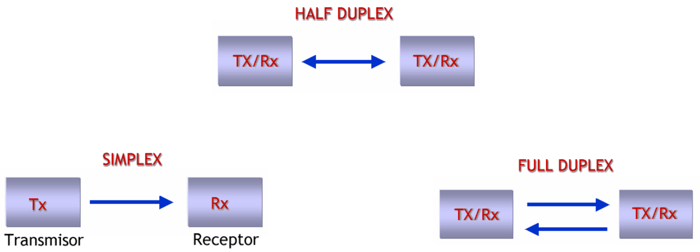
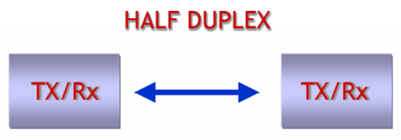
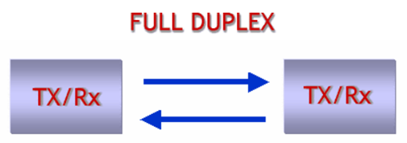
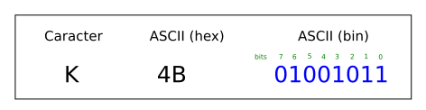

<h1>Aula 4</h1>

Esta clase consiste en entender la comunicación serial UART.

<h2>Comunicación UART</h2>

La comunicación serial (simplex, half o full duplex) permite transmitir y/o recibir datos bit a bit, punto a punto (microcontroladores, PC, sistema embebido) de forma asíncrona (UART) o síncrona (USART). 

Fuente: http://tutosrafaz.blogspot.com/2015/06/comunicacion-serial-rs232-pic16f887a.html

<h3>Tipos de comunicación serial</h3>

El modo simplex

El modo half duplex

El modo full duplex

<h3>Trama de comunicación UART</h3>

RS232 y RS485 son dos comunicaciones seriales de tipo asíncrona (UART), las cuales tienen el estándar de transmisión serie que define la trama más conocida como 8N1 (8 bits de datos, Ninguno de paridad y 1 bit de stop).

Fuente: https://github.com/Obijuan/open-fpga-verilog-tutorial/wiki/Cap%C3%ADtulo-21:-Baudios-y-transmisi%C3%B3n

Fuente: https://github.com/Obijuan/open-fpga-verilog-tutorial/wiki/Cap%C3%ADtulo-21:-Baudios-y-transmisi%C3%B3n

$$T_b=\frac{1}{V_t}$$

$$T_b=\frac{1}{9600 bits/s}$$

$$T_b=104.167 \mu s$$