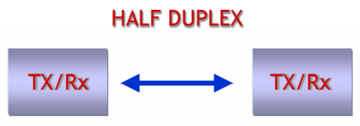
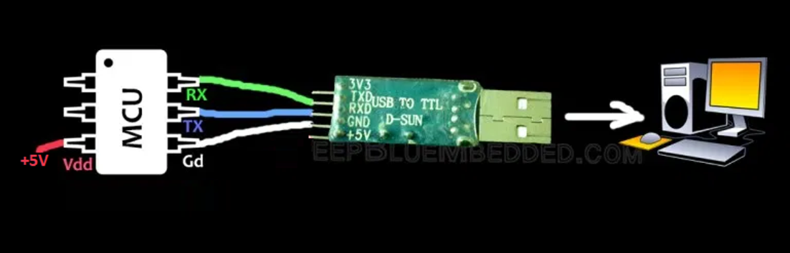
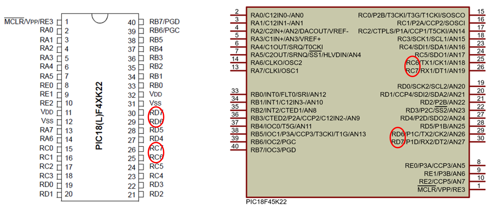
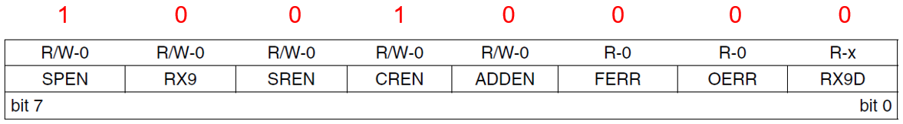
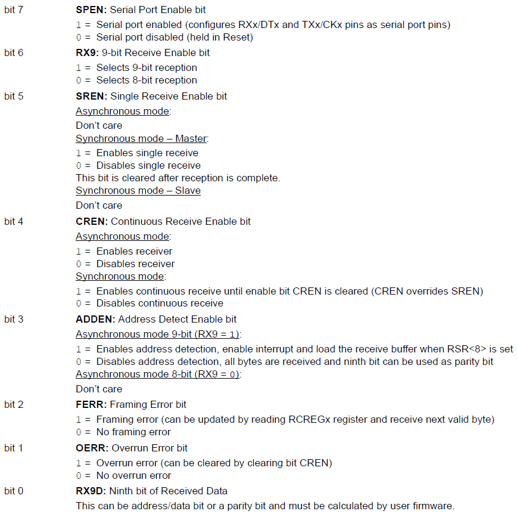
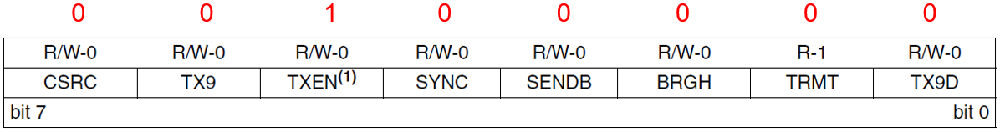
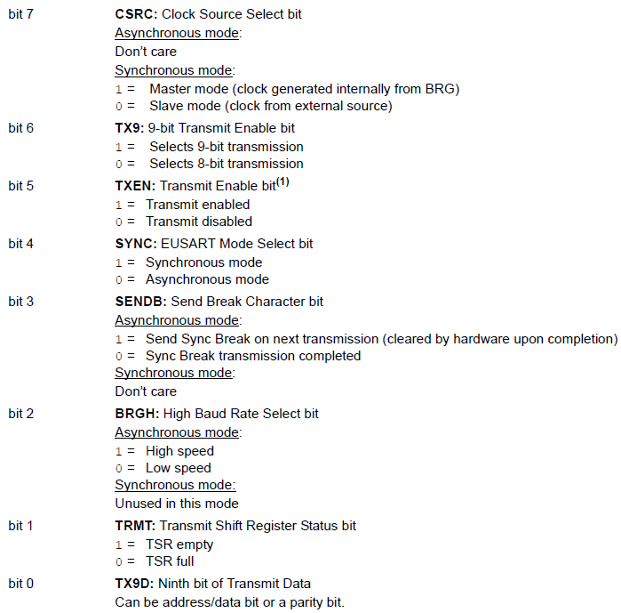
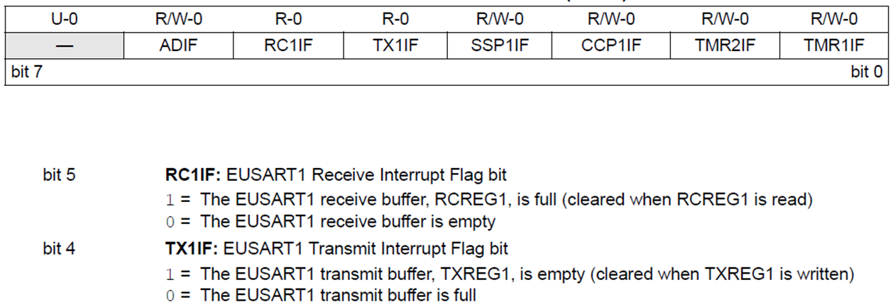

<h1>Aula 4</h1>

Esta clase consiste en entender la comunicación serial UART.

<h2>Comunicación UART</h2>

La comunicación serial (simplex, half o full duplex) permite transmitir y/o recibir datos bit a bit, punto a punto (microcontroladores, PC, sistema embebido) de forma asíncrona (UART) o síncrona (USART). 

Fuente: http://tutosrafaz.blogspot.com/2015/06/comunicacion-serial-rs232-pic16f887a.html

<h3>Tipos de comunicación serial</h3>

El modo simplex

El modo half duplex

El modo full duplex

<h3>Trama de comunicación UART</h3>

RS232 y RS485 son dos comunicaciones seriales de tipo asíncrona (UART), las cuales tienen el estándar de transmisión serie que define la trama más conocida como 8N1 (8 bits de datos, Ninguno de paridad y 1 bit de stop).

Fuente: https://github.com/Obijuan/open-fpga-verilog-tutorial/wiki/Cap%C3%ADtulo-21:-Baudios-y-transmisi%C3%B3n

Fuente: https://github.com/Obijuan/open-fpga-verilog-tutorial/wiki/Cap%C3%ADtulo-21:-Baudios-y-transmisi%C3%B3n

$$T_b=\frac{1}{V_t}$$

$$T_b=\frac{1}{9600 bits/s}$$

$$T_b=104.167 \mu s$$

<h3>FTDI</h3>

El conversor de USB a TTL (FTDI), puede alimentar +5V del PIC puede conectarse a una fuente externa o a los +5V del FTDI

https://deepbluembedded.com/usb-ttl-converter-tutorial-pc-control-for-microcontrollers/

<h3>HC-05</h3>

https://deepbluembedded.com/usb-ttl-converter-tutorial-pc-control-for-microcontrollers/

<h3>Comunicación UART en el PIC 18F45K22</h3>

Es un protocolo de comunicación que consiste en una salida y una entrada de datos, TX (Transmisión) y RX (Recepción), respectivamente. El PIC 18F45K22 tiene dos canales de comunicación EUSART. TXREGx y RCREGx son registros del modulo EUSART del PIC 18F45K22 para cargar el byte a transmitir y para guardar el byte recibido, respectivamente.

Para configurar la comunicación serial en el PIC18F45K22 es necesario tener en cuenta los siguientes pasos:

1. Configurar el pin RXx como entrada en el puerto C o D
2. Configurar el pin TXx como salida en el puerto C o D
3. Inicializar el valor de la velocidad de transmisión (baudios) a través del registro SPBRGx.
4. Configurar el registro de recepción (RCSTAx).
5. Configurar el registro de transmisión (TXSTAx).

<h4>Paso 3 - Registro SPBRG</h4>

Es un registro que permite configurar la velocidad de transmisión (baudios) de los datos en la comunicación serial.

$$𝐷𝑒𝑠𝑖𝑟𝑒𝑑 𝐵𝑎𝑢𝑑 𝑅𝑎𝑡𝑒=\frac{𝐹_{𝑂𝑆𝐶}}{64 \cdot (𝑆𝑃𝐵𝑅𝐺+1)}$$

$$𝑆𝑃𝐵𝑅𝐺𝑥=\frac{𝐹_{𝑂𝑆𝐶}}{𝐷𝑒𝑠𝑖𝑟𝑒𝑑 𝐵𝑎𝑢𝑑 𝑅𝑎𝑡𝑒 \cdot 64}−1 = \frac{16 𝑀𝐻𝑧}{9600 \cdot 64}-1=25_{10}=19_{16}$$

<h4>Paso 4 - Registro RCSTAx</h4>

Es el registro de la comunicación UART del PIC 18F45K22 que permite configurar la recepción de datos.

FERR (bit 2) = Es un error en la trama de datos, donde el receptor no detecta el bit de stop  
OERR (bit 1) = El receptor tiene datos entrantes pero el buffer de datos de recepción (RCREG) no se ha limpiado

<h4>Paso 5 - Registro TXSTAx</h4>

<h4>Registro PIR1</h4>

<h3>Ejemplo 1</h3>

Utilizar dos PIC 18F45K22, uno para realizar el contador de dos pulsos, a través de interrupciones externas y posteriormente enviar dichos datos a través de comunicación serial al otro PIC, en el cual se debe visualizar la información recibida en una pantalla LCD.

<h3>Ejemplo 2</h3>

Utilizar un PIC 18F45K22 para realizar adquisición y conversión de datos análogos a digitales de un potenciómetro y un LM35, y enviar dichos datos a través de comunicación serial con otro PIC 18F45K22 en donde se deben visualizar en una pantalla LCD. Además, visualizar los datos en tiempo real en Matlab.

<h3>Ejercicio 1</h3>

A partir del ejercicio 2, crear una interfaz gráfica en Matlab que permita monitorear los datos del voltaje del potenciómetro y de la temperatura del sensor LM35, a través de dos “push button” y graficar dichos datos en la interfaz.

<h3>Ejercicio 2</h3>

Utilizar un Bluetooth para ingresar una clave de 4 dígitos e indicar en una pantalla LCD si la clave fue exitosa o incorrecta
