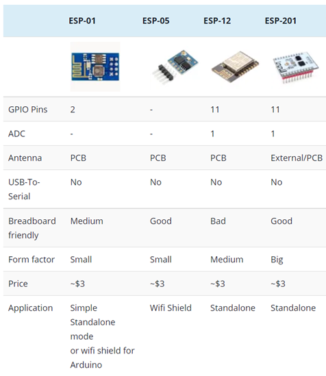
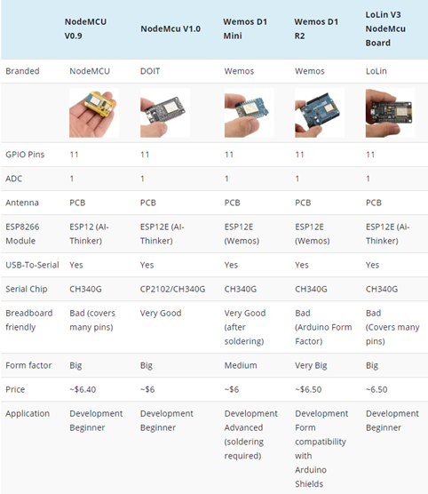
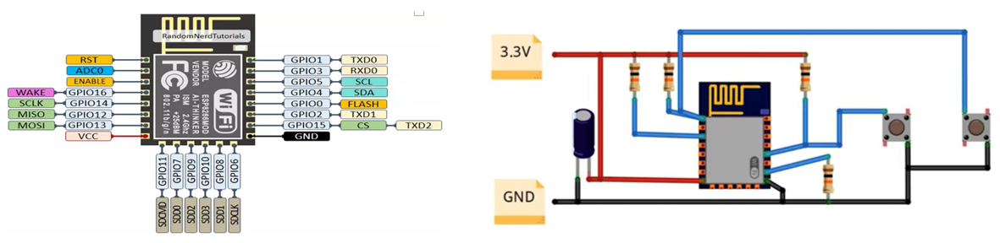

<h1>Aula 7</h1>

Esta clase consiste en agregar internet al PIC 18F45K22 con el modulo ESP12.

<h2>Revoluciones industriales</h2>

Fuente: https://wertambiental.com.br/2019/01/15/industria_4-0/

<h3>Industria 4.0</h3>

Fuente: https://www.thesmartcityjournal.com/es/tecnologia/impacto-industria-4-0-fabricas

<h4>IoT</h4>

Es la interconexión de sensores, actuadores, software y otras tecnologías a través de internet con el objetivo de interaccionar con estos sin necesidad de intervención humana

Fuente: https://tecrea.com.co/iot-y-las-empresas-que-generan-desarrollo-en-colombia-y-el-mundo/

<h3>Modulos WiFi</h3>

Fuente: https://blog.squix.org/2015/03/esp8266-module-comparison-esp-01-esp-05.html

<h3>Modulos ESP8266</h3>

Fuente: https://blog.squix.org/2015/03/esp8266-module-comparison-esp-01-esp-05.html

<h4>Modulos ESP12</h4>

Fuente: https://electronics.stackexchange.com/questions/504963/how-to-use-most-gpios-of-esp12e-for-simple-push-button-inputs-and-led-outputs

<h3>Ejemplo 1</h3>

Mostrar en una LCD el dato recibido de internet a través del modulo Wifi (ESP8266) conectado al PIC 18F45K22.	

<h3>Ejemplo 2</h3>

Encender y apagar un indicador visual en ThingSpeak a través del envío de datos con el PIC 18F45K22.
