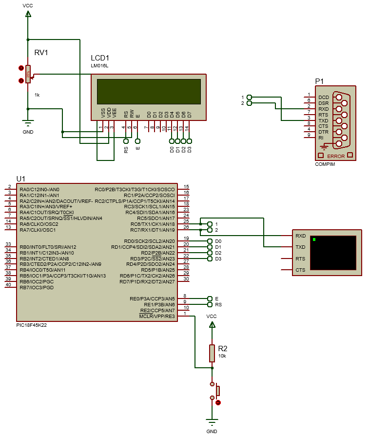
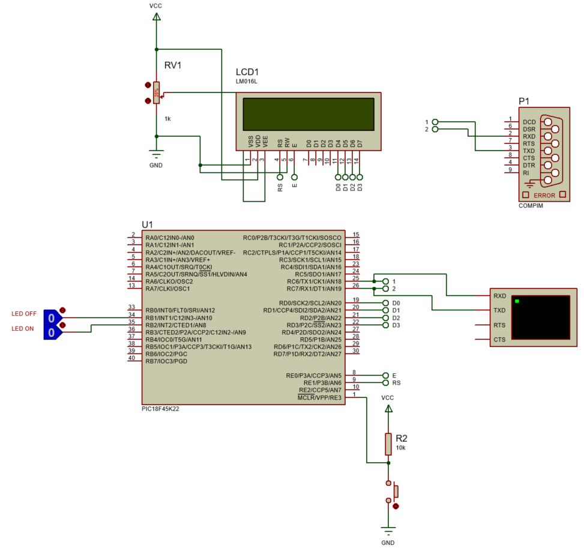

<h1>Aula 7</h1>

Esta clase consiste en agregar internet al PIC 18F45K22 con el modulo ESP12.

<h2>Revoluciones industriales</h2>


Fuente: https://wertambiental.com.br/2019/01/15/industria_4-0/

<h3>Industria 4.0</h3>


Fuente: https://www.thesmartcityjournal.com/es/tecnologia/impacto-industria-4-0-fabricas

<h4>IoT</h4>

Es la interconexión de sensores, actuadores, software y otras tecnologías a través de internet con el objetivo de interaccionar con estos sin necesidad de intervención humana


Fuente: https://tecrea.com.co/iot-y-las-empresas-que-generan-desarrollo-en-colombia-y-el-mundo/


<h3>Modulos WiFi</h3>


Fuente: https://blog.squix.org/2015/03/esp8266-module-comparison-esp-01-esp-05.html

<h3>Modulos ESP8266</h3>


Fuente: https://blog.squix.org/2015/03/esp8266-module-comparison-esp-01-esp-05.html

<h4>Modulos ESP12</h4>


Fuente: https://electronics.stackexchange.com/questions/504963/how-to-use-most-gpios-of-esp12e-for-simple-push-button-inputs-and-led-outputs

<h3>Ejemplo 1</h3>

Mostrar en una LCD el dato recibido de internet a través del modulo Wifi (ESP8266) conectado al PIC 18F45K22.	



PIC

```c
#include <xc.h>

#pragma config FOSC = INTIO67
#pragma config WDTEN = OFF
#pragma config LVP = OFF

#define _XTAL_FREQ 16000000
#define time 10
//LCD
#define CD 0x01 //Clear Display
#define RH 0x02 //(0x03) Return Home
#define EMS 0x06 //Entry Mode Set
#define DC 0x0F //(0x0E) Display Control
#define DSr 0x1C //Display Shift Rigth
#define DSl 0x18 //Display Shift Left
#define FS 0x28 //(0x3C) Function Set
#define RAW1 0x80 //DDRAM display
#define RAW2 0xC0 //DDRAM display
#define RS LATE1 //Register Selection
#define E LATE0 //Enable

void settings(void);
void __interrupt() RECEIVE(void);
//LCD
void SettingsLCD(unsigned char word);
void WriteLCD(unsigned char word);
void LCD(unsigned char data);

void main(void) {
    settings();
    while(1){
        
    }
}

void SettingsLCD(unsigned char word){
    RS = 0;
    LCD(word >> 4); // 4 MSB
    LCD(word & 0x0F); // 4 LSB
}

void WriteLCD(unsigned char word){
    RS = 1;
    LCD(word >> 4);
    LCD(word & 0x0F);
}

void LCD(unsigned char data){ //Opción bits
    E = 1;
    __delay_us(time*5);
    LATDbits.LATD0 = (data & 0x01);
    __delay_us(time*5);
    LATDbits.LATD1 = (data & 0x02) >> 1;
    __delay_us(time*5);
    LATDbits.LATD2 = (data & 0x04) >> 2;
    __delay_us(time*5);
    LATDbits.LATD3 = (data & 0x08) >> 3;
    __delay_us(time*5);
    E = 0;
    __delay_us(time*5);
}

void settings(void){
    OSCCON = 0x72;
    ANSELC = 0x00;
    ANSELD = 0x00;
    ANSELE = 0x00;
    TRISD = 0;
    TRISE = 0;
    LATD = 0;
    LATE = 0;
    //LCD
    SettingsLCD(0x02); //Iniciar la LCD con el método nibble (4 MSB y 4 LSB)
    SettingsLCD(EMS);
    SettingsLCD(DC);
    SettingsLCD(FS);
    SettingsLCD(CD);
    //Serial UART
    TRISCbits.TRISC6 = 0;
    TRISCbits.TRISC7 = 1;
    SPBRG = 0x19;
    RCSTA = 0x90;
    TXSTA = 0x20;
    //Interrupción
    GIE = 1;
    PEIE = 1;
    RCIE = 1;
    RCIF = 0;
}

void __interrupt() RECEIVE(void){
    unsigned char d;
    if(RCIF == 1){
        d = RCREG;
        if(d == 'a' || d == 'b'){
            SettingsLCD(RAW2);
            WriteLCD(d);
        }else if(d == 0x0D){
            SettingsLCD(RH);
        }else{
            WriteLCD(d);
        }
    }    
}

```

ESP12

```c++

#include <ESP8266WiFi.h>

WiFiServer server(80);

const char* network = "Bart";
const char* password = "holamundo";
int cont = 0;

void setup() {
  Serial.begin(9600);
  Serial.print("Conectandose a red : ");
  Serial.print(network);
  Serial.print("\n\r");
  WiFi.begin(network, password); //Conexión a la red
  while (WiFi.status() != WL_CONNECTED) //Mientras no esté conectado imprime por el puerto serial
  {
    delay(500);
    Serial.print(".");
  }
  Serial.print("\n\r");
  Serial.print("WiFi conectado"); //La conexión se completó exitosamente
  Serial.print("\n\r");
  server.begin(); //Iniciamos el servidor
  Serial.print("Servidor Iniciado");
  Serial.print("\n\r");
  Serial.print("Ingrese desde un navegador web usando la siguiente IP:");
  Serial.print("\n\r");
  Serial.print(WiFi.localIP()); //Obtenemos la IP  //La ip local del cliente (ESP12-E)
  Serial.print("\n\r");
}

void loop() {
  WiFiClient client = server.available();
  if (client) { //Si hay un cliente presente
    //    Serial.println("Nuevo Cliente");
    while (!client.available() && client.connected()) {
      delay(1);
    }
    // Leemos la primera línea de la petición del cliente.
    String linea1 = client.readStringUntil('r');
    //    Serial.print(linea1);
    //    Serial.print("\n\r");
    if (linea1.indexOf("boton=a") > 0) //Buscamos un LED=ON en la 1°Linea
    {
      Serial.print("a");
      Serial.print("\n\r");
    }
    if (linea1.indexOf("boton=b") > 0) //Buscamos un LED=OFF en la 1°Linea
    {
      Serial.print("b");
      Serial.print("\n\r");
    }
    client.flush();

    //    Serial.print("Enviando respuesta...");
    //    Serial.print("\n\r");
    //Encabezado http
    client.println("HTTP/1.1 200 OK");
    client.println("Content-Type: text/html");
    client.println("Connection: close");// La conexión se cierra después de finalizar de la respuesta
    client.println();
    //Pagina html  para en el navegador
    client.println("<!DOCTYPE HTML>");
    client.println("<html>");
    client.println("<head><title>ESP12-E LED</title>");
    client.println("<body>");
    client.println("<h1 align='center'>Ejemplo 1 - IoT(ESP8266)</h1>");
    client.println("<div style='text-align:center;'>");
    client.println("<br />");
    client.println("<button onClick=location.href='./?boton=a'>comando a</button>");
    client.println("<button onClick=location.href='./?boton=b'>b</button>");
    client.println("<br />");
    client.println("</div>");
    client.println("</body>");
    client.println("</html>");

    delay(1);
    //    Serial.print("respuesta enviada");
    //    Serial.print("\n\r");
  }

  cont++;
  Serial.print(cont);
  Serial.print("\n\r");
  delay(1000);
}
```

<h3>Ejemplo 2</h3>

Encender y apagar un indicador visual en ThingSpeak a través del envío de datos con el PIC 18F45K22.



PIC

```c
#include <xc.h>
#include <stdio.h>
#include <string.h>

#pragma config FOSC = INTIO67
#pragma config WDTEN = OFF
#pragma config LVP = OFF

#define _XTAL_FREQ 16000000
#define time 10
//LCD
#define CD 0x01 //Clear Display
#define RH 0x02 //(0x03) Return Home
#define EMS 0x06 //Entry Mode Set
#define DC 0x0F //(0x0E) Display Control
#define DSr 0x1C //Display Shift Rigth
#define DSl 0x18 //Display Shift Left
#define FS 0x28 //(0x3C) Function Set
#define RAW1 0x80 //DDRAM display
#define RAW2 0xC0 //DDRAM display
#define RS LATE1 //Register Selection
#define E LATE0 //Enable

void settings(void);
void __interrupt() Tx(void);
//LCD
void SettingsLCD(unsigned char word);
void WriteLCD(unsigned char word);
void LCD(unsigned char data);

void main(void) {
    settings();
    while(1){
        
    }
}

void settings(void){
    OSCCON = 0x72;
    ANSELB = 0x00;
    ANSELC = 0x00;
    TRISB = 0x06;
    ANSELD = 0x00;
    ANSELE = 0x00;
    TRISD = 0;
    TRISE = 0;
    LATD = 0;
    LATE = 0;
    //LCD
    SettingsLCD(0x02); //Iniciar la LCD con el método nibble (4 MSB y 4 LSB)
    SettingsLCD(EMS);
    SettingsLCD(DC);
    SettingsLCD(FS);
    SettingsLCD(CD);
    //Serial UART
    TRISCbits.TRISC6 = 0;
    TRISCbits.TRISC7 = 1;
    SPBRG1 = 0x19;
    RCSTA1 = 0x90;
    TXSTA1 = 0x20;
    //Interrupción externa
    GIE = 1;
    INT2IE = 1;
    INT1IE = 1;
    INT2IF = 0;
    INT1IF = 0;
    INTEDG2 = 1;
    INTEDG1 = 0;
}

void __interrupt() Tx(void){
    if(INT2IF == 1){
        INT2IF = 0;
        SettingsLCD(RAW1);
        WriteLCD('c');
        while(TX1IF == 0);
        TXREG1 = 'c';
        while(TXIF == 0);
        TXREG = 0x0A;//Salto de línea
        while(TX1IF == 0);
        TXREG1 = 0x0D;//Retorno de carro
    }
    if(INT1IF == 1){
        INT1IF = 0;
        SettingsLCD(RAW1);
        WriteLCD('d');
        while(TX1IF == 0);
        TXREG1 = 'd';
        while(TXIF == 0);
        TXREG = 0x0A;//Salto de línea
        while(TX1IF == 0);
        TXREG1 = 0x0D;//Retorno de carro
    }
}

void SettingsLCD(unsigned char word){
    RS = 0;
    LCD(word >> 4); // 4 MSB
    LCD(word & 0x0F); // 4 LSB
}

void WriteLCD(unsigned char word){
    RS = 1;
    LCD(word >> 4);
    LCD(word & 0x0F);
}

void LCD(unsigned char data){ //Opción bits
    E = 1;
    __delay_us(time*5);
    LATDbits.LATD0 = (data & 0x01);
    __delay_us(time*5);
    LATDbits.LATD1 = (data & 0x02) >> 1;
    __delay_us(time*5);
    LATDbits.LATD2 = (data & 0x04) >> 2;
    __delay_us(time*5);
    LATDbits.LATD3 = (data & 0x08) >> 3;
    __delay_us(time*5);
    E = 0;
    __delay_us(time*5);
}
```

ESP12

```c++
#include <ESP8266WiFi.h>
#include "ThingSpeak.h"

#define led 2

WiFiClient client;

const char* network = "Bart";
const char* password = "holamundo";
char data;

unsigned long myChannelNumber = 1;
const char * myWriteAPIKey = "GH3I07IW0IKICKVE";

void setup() {
  Serial.begin(9600);
  Serial.print("Conectandose a red : ");
  Serial.print(network);
  Serial.print("\n\r");
  WiFi.begin(network, password); //Conexión a la red
  while (WiFi.status() != WL_CONNECTED) //Mientras no esté conectado imprime por el puerto serial
  {
    delay(500);
    Serial.print(".");
  }
  Serial.print("\n\r");
  Serial.print("WiFi conectado"); //La conexión se completó exitosamente
  Serial.print("\n\r");
  WiFi.mode(WIFI_STA);
  ThingSpeak.begin(client);  // Initialize ThingSpeak
  pinMode(led, OUTPUT);
}

void loop() {

  if (Serial.available() > 0) {
    //leemos el dato enviado
    data = Serial.read();
  }
  if (data == 'c') {
    digitalWrite(led, HIGH);
    data = '0';
    ThingSpeak.setField(1, 1);
  } else if (data == 'd') {
    digitalWrite(led, LOW);
    data = '0';
    ThingSpeak.setField(1, 0);
  }

  ThingSpeak.writeFields(myChannelNumber, myWriteAPIKey);

  delay(1000);
}
```