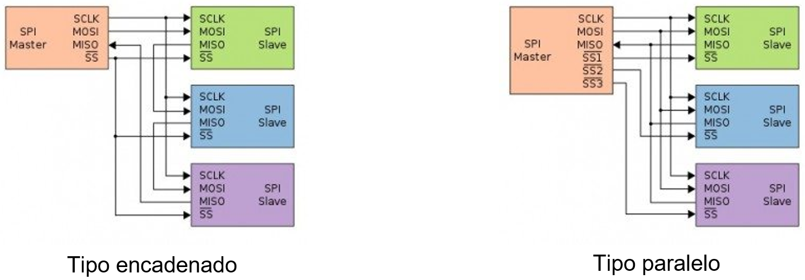
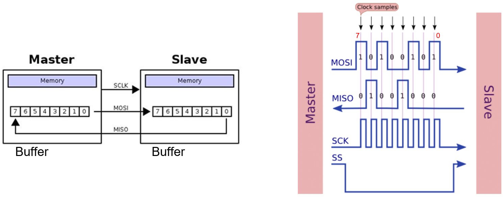
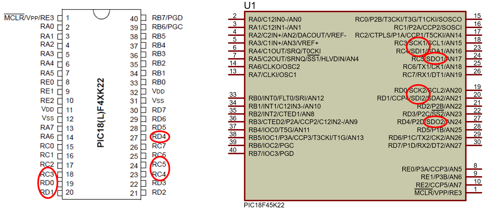
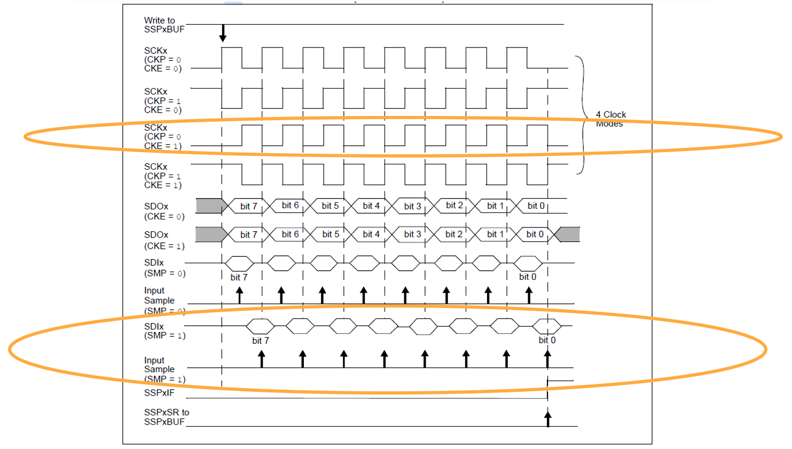
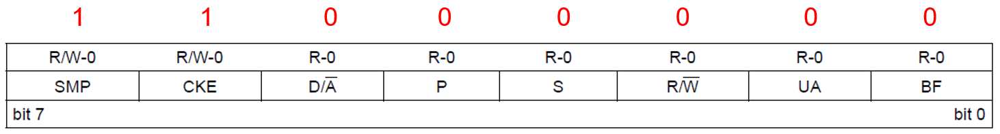
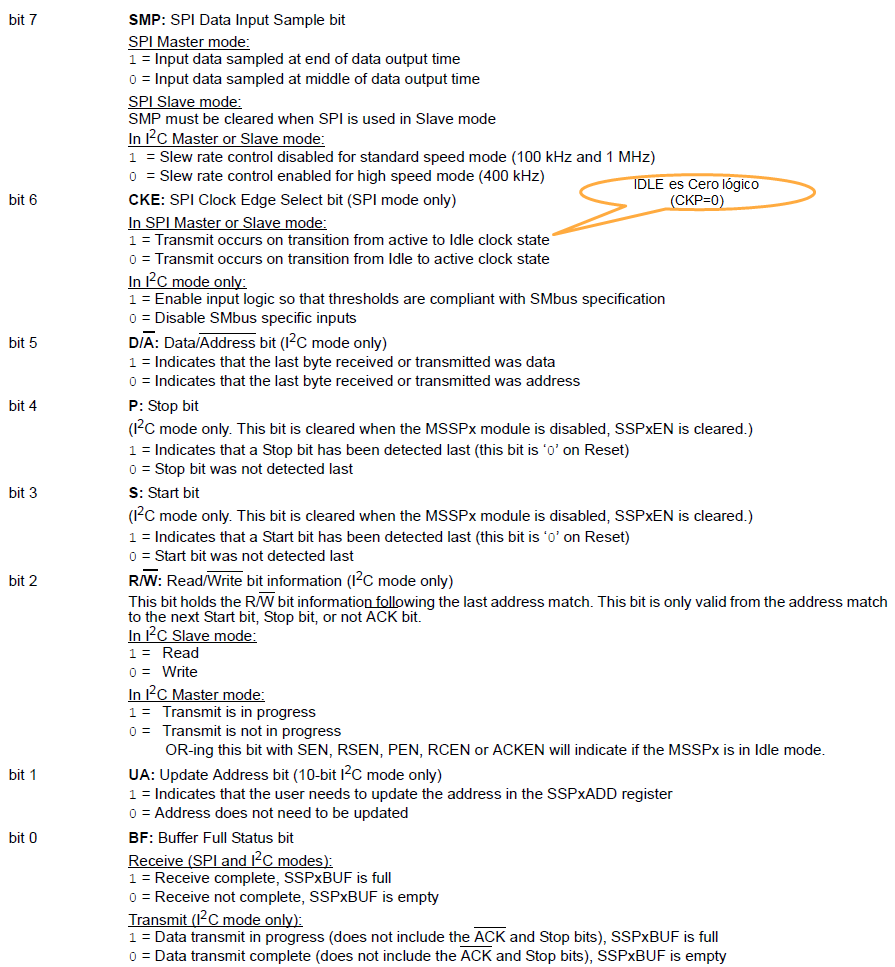
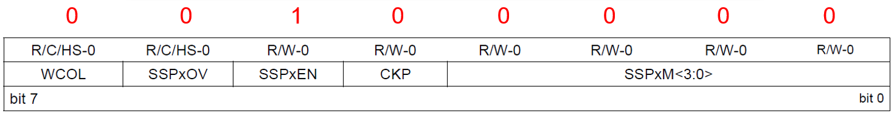
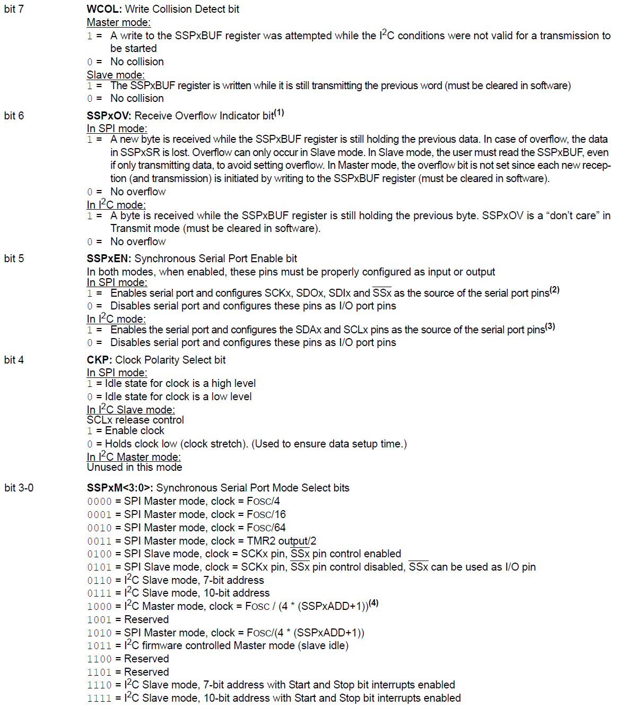

<h1>Aula 9</h1>

En esta clase se explica el protocolo de comunicación serial SPI

<h2>SPI</h2>

SPI (Serial Peripheral Interface) es una comunicación tipo ‘full duplex’ que puede ser realizada entre un maestro y uno o más esclavos, a partir de una señal de reloj (SCK), dos señales de datos (MOSI y MISO) y una señal de habilitación (SS=0).

Fuente: http://panamahitek.com/como-funciona-el-protocolo-spi/

 La velocidad del puerto SPI está estandarizada en 10Mbps. Basa su funcionamiento en un registro de desplazamiento (shift register)

Fuente: https://vidaembebida.wordpress.com/2017/02/08/protocolo-de-comunicacion-spi/

Fuente: https://controlautomaticoeducacion.com/microcontroladores-pic/comunicacion-spi/

<h3>SPI en el PIC 18F45K22</h3>

La comunicación SPI es realizada a través de los pines SCKx (RC3 y/o RD0), SDIx (RC4 y/o RD1), SDOx (RC5 y/o RD4) y SS del PIC 18F45K22 para la recepción y transmisión de datos, y habilitación del esclavo síncronamente.

Para configurar la comunicación SPI en el PIC18F45K22 es necesario tener en cuenta los siguientes pasos:

1. Configurar los pines SDIx como entrada y SDOx, SCKx y SSx como salidas
2. Configurar el registro SSPxSTAT 
3. Habilitar la comunicación SPI y el modo maestro a través del bit SSPEN del registro SSPxCON1

<h4>SSPxSTAT</h4>

<h4>SSPxCON1</h4>

