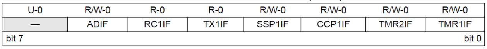
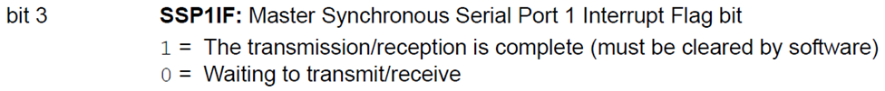
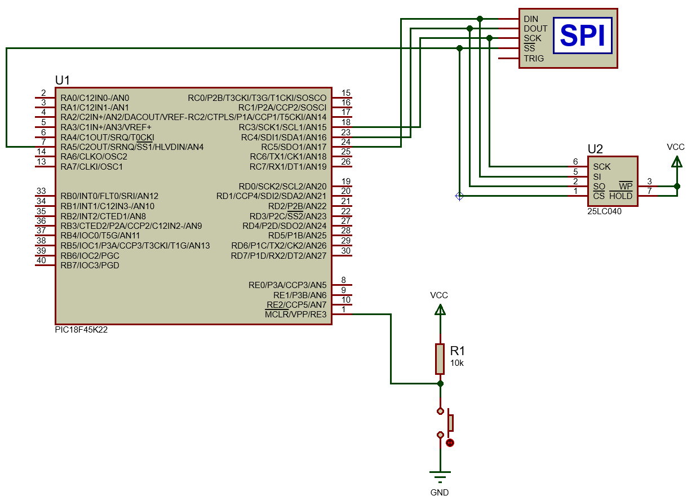
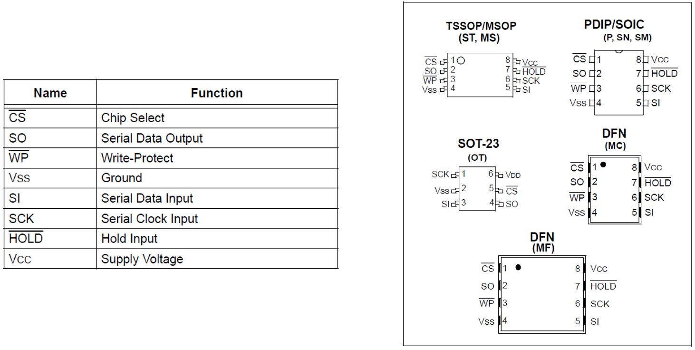
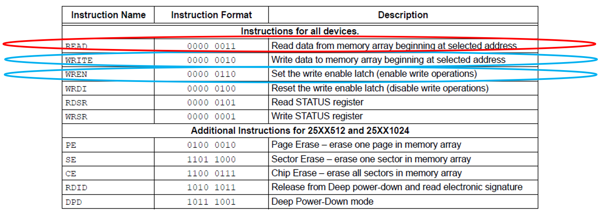
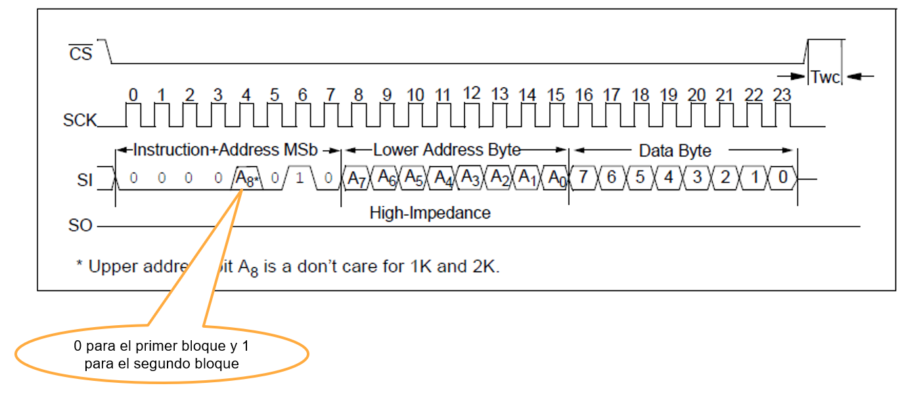
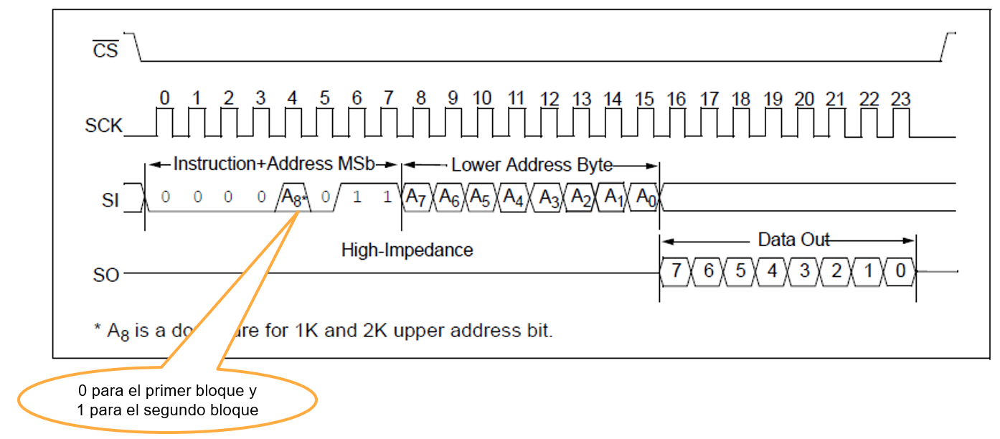

<h1>Aula 9</h1>

En esta clase se explica el protocolo de comunicación serial SPI

<h2>SPI</h2>

SPI (Serial Peripheral Interface) es una comunicación tipo ‘full duplex’ que puede ser realizada entre un maestro y uno o más esclavos, a partir de una señal de reloj (SCK), dos señales de datos (MOSI y MISO) y una señal de habilitación (SS=0).


Fuente: http://panamahitek.com/como-funciona-el-protocolo-spi/

 La velocidad del puerto SPI está estandarizada en 10Mbps. Basa su funcionamiento en un registro de desplazamiento (shift register)


Fuente: https://vidaembebida.wordpress.com/2017/02/08/protocolo-de-comunicacion-spi/

Fuente: https://controlautomaticoeducacion.com/microcontroladores-pic/comunicacion-spi/

<h3>SPI en el PIC 18F45K22</h3>

La comunicación SPI es realizada a través de los pines SCKx (RC3 y/o RD0), SDIx (RC4 y/o RD1), SDOx (RC5 y/o RD4) y SS del PIC 18F45K22 para la recepción y transmisión de datos, y habilitación del esclavo síncronamente.


Para configurar la comunicación SPI en el PIC18F45K22 es necesario tener en cuenta los siguientes pasos:

1. Configurar los pines SDIx como entrada y SDOx, SCKx y SSx como salidas
2. Configurar el registro SSPxSTAT 
3. Habilitar la comunicación SPI y el modo maestro a través del bit SSPEN del registro SSPxCON1


<h4>SSPxSTAT</h4>


<h4>SSPxCON1</h4>


<h4>PIR1</h4>





<h3>Ejemplo 1</h3>

Escribir y leer datos en una memoria EEPROM de 512 bytes (25LC04) a través de SPI.



<h4>EEPROM 25LC04</h4>

Capacidad de 4096bits (512bytes) <br>
2 bloques de 256 registros, cada registro es 1 byte (8 bits) <br>
Más que 1 millón de ciclos de borrado/escritura <br>





<h5>WRITE EEPROM 25LC04</h5>



<h5>READ EEPROM 25LC04</h5>



<h5>PIC</h5>

```c
#include <xc.h>

#pragma config FOSC = INTIO67
#pragma config WDTEN = OFF
#pragma config LVP = OFF

#define _XTAL_FREQ 16000000
#define time 10
//SPI
#define SS1 LATA5
//EEPROM 25LC04
#define WREN 0x06
#define WRITE 0x02
#define READ 0x03
#define WBlock1 0x02
#define WBlock2 0x0A
#define RBlock1 0x03
#define RBlock2 0x0B

void settings(void);
//EEPROM 25LC04
void SendSPI(unsigned char data);
void WriteSPI(unsigned char a, unsigned char b, unsigned char Register, unsigned char Data, int N);
unsigned char ReceivedSPI(void);
void ReadSPI(unsigned char b, unsigned char Register, unsigned char *Data, int N);

unsigned char i, bytes[7];

void main(void) {
    settings();
    while(1){
        WriteSPI(WREN,WBlock1,0x00,0x48,6);
        ReadSPI(RBlock1,0x02,bytes,7);
    }
}

void settings(void){
    OSCCON = 0x72;
    ANSELA = 0x00;
    ANSELC = 0x00;
    //SPI
    TRISCbits.TRISC5 = 0; //SDO1 (MOSI)
    TRISCbits.TRISC3 = 0; //SCK1
    TRISC4 = 1; //SDI1 (MISO)
    TRISA5 = 0; //SS1
    SS1 = 1;//Deshabilitación del esclavo
    SSP1STAT = 0xC0;
    SSP1CON1 = 0x20;
    SSP1IF = 0;
}

void SendSPI(unsigned char data){
    unsigned char buffer;
    SSP1BUF = data;
    while(!SSP1IF);
    SSP1IF = 0;
    buffer = SSP1BUF;
}

void WriteSPI(unsigned char a, unsigned char b, unsigned char Register, unsigned char Data, int N){
    SS1 = 0;
    SendSPI(a);
    SS1 = 1;
    SS1 = 0;
    SendSPI(b);//0x0A
    SendSPI(Register);
    for(i=0; i<N; i++){
        SendSPI(Data+i);
    }
    SS1 = 1;
    __delay_ms(time*100);
}

unsigned char ReceivedSPI(void){
    SSP1BUF = 0x00;
    while(!SSP1IF);
    SSP1IF = 0;
    return SSP1BUF;
}

void ReadSPI(unsigned char b, unsigned char Register, unsigned char *Data, int N){
    SS1 = 0;
    SendSPI(b);
    SendSPI(Register);
    for(i=0; i<N; i++){
        *Data = ReceivedSPI();
        Data++;
    }
    SS1 = 1;
    __delay_ms(time*100);
}
```


