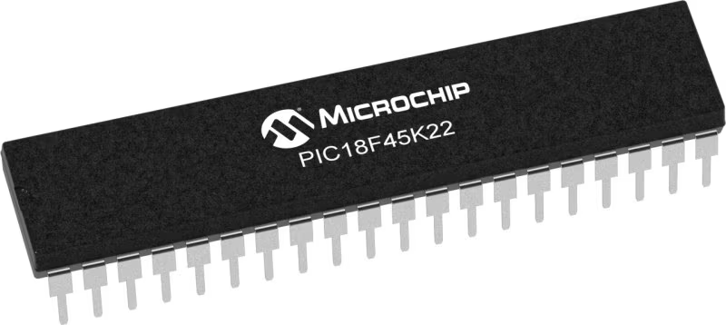
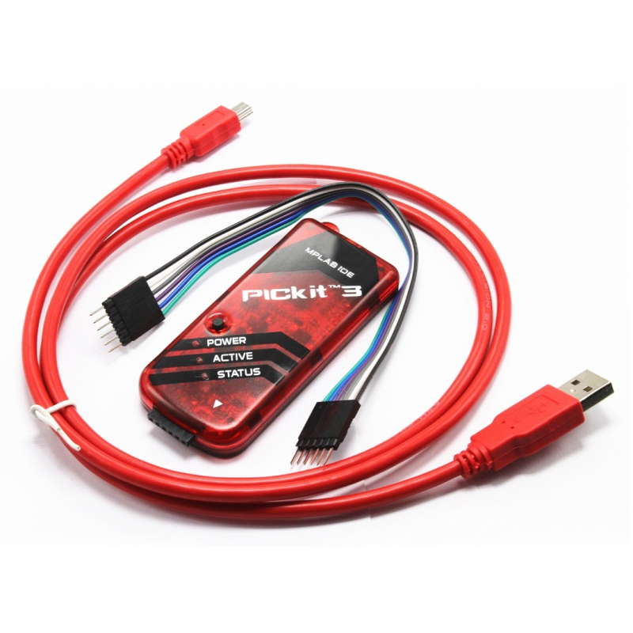
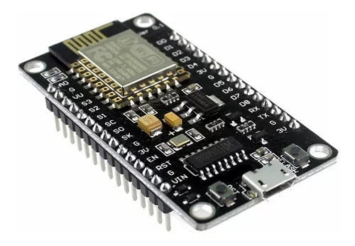
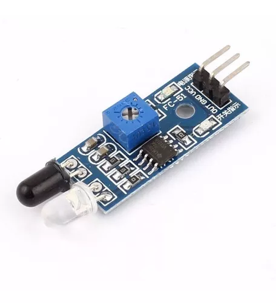

<h1 align="center">Profesor: MSc. Fabián Barrera Prieto 👨‍🏫 
Materia: Seminario de Microcontroladores con IoT 🤖 
Universidad: ECCI 🏫 
Año: 2024 📅</h1> 

El curso de microcontroladores está enfocado al estudio y desarrollo de aplicaciones automatizadas con UART, SPI, I2C e IoT a través del PIC 18F45K22, que es un microcontrolador de bajo costo. 

<h1>Aula 1</h1>

En esta clase se presenta la materia, en cuanto al contenido temático, los métodos de evaluación, las observaciones, las NO EXCUSAS y los recursos para el desarrollo del curso.

<h2>Presentación de la materia 🚀</h2>

<h3>TEMAS 🤓</h3>

<h4>Primera semana</h4>

<table>
	<tr>
		<td>Fecha</td> <td>Horas</td> <td>Clase</td> <td>Semana</td> <td>Actividades</td>
	</tr>
	<tr>
		<td>04/06/2024</td> <td>2</td> <td>1</td> <td>1</td> <td>Presentación del seminario</td>
	</tr>
    <tr>
		<td>04/06/2024</td> <td>2</td> <td>2</td> <td>1</td> <td>Introducción PIC 18F45K22</td>
	</tr>
	<tr>
		<td>05/06/2024</td> <td>2</td> <td>3</td> <td>2</td> <td>GLCD</td>
	</tr>
	<tr>
		<td>05/06/2024</td> <td>2</td> <td>4</td> <td>2</td> <td>Ejemplo GLCD</td>
	</tr>
	<tr>
		<td>06/06/2024</td> <td>2</td> <td>5</td> <td>3</td> <td>UART</td>
	</tr>
	<tr>
		<td>06/06/2024</td> <td>2</td> <td>6</td> <td>3</td> <td>Ejemplos UART</td>
	</tr>
    <tr>
		<td>07/06/2024</td> <td>2</td> <td>7</td> <td>4</td> <td>IoT</td>
	</tr>
    <tr>
		<td>07/06/2024</td> <td>2</td> <td>8</td> <td>4</td> <td>Ejemplo IoT</td>
	</tr>

</table>

<h4>Segunda semana</h4>

<table>
	<tr>
		<td>Fecha</td> <td>Horas</td> <td>Clase</td> <td>Semana</td> <td>Actividades</td>
	</tr>
	<tr>
		<td>11/06/2024</td> <td>2</td> <td>11</td> <td>6</td> <td>Desarrollo de laboratorios y proyecto</td>
	</tr>
	<tr>
		<td>11/06/2024</td> <td>2</td> <td>12</td> <td>6</td> <td>Desarrollo de laboratorios y proyecto</td>
	</tr>
	<tr>
		<td>12/06/2024</td> <td>2</td> <td>13</td> <td>7</td> <td>Desarrollo de laboratorios y proyecto</td>
	</tr>
	<tr>
		<td>12/06/2024</td> <td>2</td> <td>14</td> <td>7</td> <td>Desarrollo de laboratorios y proyecto</td>
	</tr>
	<tr>
		<td>13/06/2024</td> <td>2</td> <td>15</td> <td>8</td> <td>Desarrollo de laboratorios y proyecto</td>
	</tr>
    <tr>
		<td>13/06/2024</td> <td>2</td> <td>16</td> <td>8</td> <td>Desarrollo de laboratorios y proyecto</td>
	</tr>
    <tr>
		<td>14/06/2024</td> <td>2</td> <td>17</td> <td>9</td> <td>Desarrollo de laboratorios y proyecto</td>
	</tr>
    <tr>
		<td>14/06/2024</td> <td>2</td> <td>18</td> <td>9</td> <td>Desarrollo de laboratorios y proyecto</td>
	</tr>

</table>

<h4>Tercera semana</h4>

<table>
	<tr>
		<td>Fecha</td> <td>Horas</td> <td>Clase</td> <td>Semana</td> <td>Actividades</td>
	</tr>
	<tr>
		<td>17/06/2024</td> <td>2</td> <td>21</td> <td>11</td> <td>Desarrollo de laboratorios y proyecto</td>
	</tr>
	<tr>
		<td>17/06/2024</td> <td>2</td> <td>22</td> <td>11</td> <td>Desarrollo de laboratorios y proyecto</td>
	</tr>
	<tr>
		<td>18/06/2024</td> <td>2</td> <td>23</td> <td>12</td> <td>Desarrollo de laboratorios y proyecto</td>
	</tr>
	<tr>
		<td>18/06/2024</td> <td>2</td> <td>24</td> <td>12</td> <td>Desarrollo de laboratorios y proyecto</td>
	</tr><!--Finalización de clases-->
	<tr>
		<td>19/06/2024</td> <td>2</td> <td>25</td> <td>13</td> <td>Desarrollo de laboratorios y proyecto</td>
	</tr>
    <tr>
		<td>19/06/2024</td> <td>2</td> <td>26</td> <td>13</td> <td>Desarrollo de laboratorios y proyecto</td>
	</tr>
    <tr>
		<td>20/06/2024</td> <td>2</td> <td>27</td> <td>14</td> <td>Desarrollo de Laboratorios y proyecto</td>
	</tr>
    <tr>
		<td>20/06/2024</td> <td>2</td> <td>28</td> <td>14</td> <td>Desarrollo de laboratorios y proyecto</td>
	</tr>
    <tr>
		<td>21/06/2024</td> <td>2</td> <td>29</td> <td>15</td> <td>Desarrollo de Laboratorios y proyecto</td>
	</tr>
    <tr>
		<td>21/06/2024</td> <td>2</td> <td>30</td> <td>15</td> <td>Desarrollo de Laboratorios y proyecto</td>
	</tr>

</table>

<h4>Cuarta semana</h4>

<table>
	<tr>
		<td>Fecha</td> <td>Horas</td> <td>Clase</td> <td>Semana</td> <td>Actividades</td>
	</tr>
	<tr>
		<td>24/06/2024</td> <td>2</td> <td>21</td> <td>11</td> <td>Desarrollo de proyecto</td>
	</tr>
	<tr>
		<td>24/06/2024</td> <td>2</td> <td>21</td> <td>11</td> <td>Desarrollo de proyecto</td>
	</tr>
	<tr>
		<td>25/06/2024</td> <td>2</td> <td>22</td> <td>11</td> <td>Desarrollo de proyecto</td>
	</tr>
	<tr>
		<td>25/06/2024</td> <td>2</td> <td>22</td> <td>11</td> <td>Desarrollo de proyecto</td>
	</tr>

</table>

<h3>MÉTODOS DE EVALUACIÓN ✍️</h3>

<table>
	<tr>
		<td>Actividad</td>
		<td>Porcentaje 💯</td>
		<td>Fecha</td>
		<td>Metodología</td>
	</tr>
	<tr>
		<td>Quices</td>
		<td>10%</td>
		<td>Dos por semana</td>
		<td rowspan="3">Presencial</td>
	</tr>
	<tr>
		<td>Laboratorios y/o talleres</td>
		<td>40%</td>
		<td>14/02/2024 20/02/2024 21/02/2024</td>
	</tr>
    <tr>
		<td>Proyecto</td>
		<td>50%</td>
		<td>25/06/2024</td>
	</tr>
</table>

Nota del curso = (0.1)*Quices + (0.4)*Laboratorios y/o talleres + (0.5)*Proyecto

<h3>OBSERVACIONES ⚠️</h3>

<h4>Observaciones de clase</h4>
	<ul>
		<li> Inicio de clases: Quince (15) minutos después de la hora inicial definida de la clase y el control de asistencia se realiza a cada inicio de clase ⌚</li>
		<li> Fin de clases: Quince (15) minutos antes de la hora final definida de la clase ⏱️</li>
		<li> Respeto en clase 🤝</li>
		<li> No presto mi computador para presentar laboratorios, talleres y/o proyectos 🤦‍♂️</li>
		<li> Prohibido el uso de celular en quices, parciales y clase 📵</li>
		<li> Permitidas las salidas al baño 🚻 y a recibir llamadas 📲, en los quices y parciales se debe dejar el celular en el puesto para salir al baño</li>
		<li> Si no dejan dictar la clase, pasan al tablero a dar la clase o doy la clase por vista 😤</li>
		<li> No es permitido tomar fotos, ni videos en clase 📵. El material de clase está en el siguiente repositorio git: https://github.com/FBarreraP/SeminarioMicrosIoT </li>
		<li> Los laboratorios (excepto el de GLCD) y el proyecto consistirán únicamente de montaje y podrán ser realizados en grupos de máximo 2 estudiantes 🧍‍♂️🧍‍♀️</li>
		<li> Los montajes realizados en protoboard no son aceptados con jumpers, por tanto, deben ser realizados con cable UTP y no son compartidos, es decir, un montaje por grupo 🤷‍♂️</li>
		<li> Los talleres se calificarán con rúbricas de 0.0 a 5.0 con intervalo de 1.0; las cuales tendrán diferentes entregables con fechas fijas de entrega y el orden de entrega de los grupos será definida por el profesor 💥</li> 
		<li> Los quices serán individuales y con esfero 📄</li> 
		<li> Si llegan tarde a la clase deben investigar posteriormente sobre el tema perdido ✍️</li> 
        <li> Uso obligatorio de bata blanca en el laboratorio 🥼</li>
	</ul>

<h4>Observaciones de reglamento estudiantil</h4>
<ul>
	<li> Revisión sobre la calificación solamente dentro de los dias (3) establecidos en el reglamento estudiantil </li>
	<li> Con el 10% de las fallas se pierde la materia</li>
	<li> Las ausencias a clases donde se saque una calificación se debe presentar la excusa familiar o laboral en la dirección del programa</li>
	<li> El seminario se aprueba con una calificación final igual o superior a 3.5 </li>
</ul>

<h3>NO EXCUSAS ❌</h3>

<ul>
	<li> Hace 5 minutos funcionaba (tengo un video funcionando) 😒</li>
	<li> Mi compañero tiene todo y no ha llegado 😐</li>
	<li> Mírelo ya, porque deja de funcionar 🤨</li>
	<li> Tengo más materias 🙄</li>
	<li> Trabajo y estudio 😶</li>
	<li> Se dañó en el bus 🤔</li>
	<li> No lo toque, no lo mire, ni se acerque mucho porque se daña 🤨</li>
</ul>

<h3>RECURSOS 🛠️</h3>

<ul>
	<li> Computador 💻</li>
	<li> Matlab</li>
	<li> MPLAB X con XC8</li>
	<li> Proteus</li>
	<li> PIC</li>
	
	<li> PIC Kit</li>
		
	<li> Módulo WiFi (ESP8266 Nodemcu V3)</li>
	
	<li> Plataforma diferencial</li>
    
	 <li> Motoreductor DC</li>
    
    <li> Fuentes de alimentación</li>
    
    <li> Multimetro</li>
    
    <li> Leds, resistencias, pulsadores, cables, protoboard</li>
    
    <li> Potenciómetro</li>
    
    <li> Display LCD 16x2 o 16x4 o 20x2 o 20x4</li>
    
    <li> Sensor infrarrojo</li>
    
    <li> Puente H (L298/L293)</li>
    
</ul>
